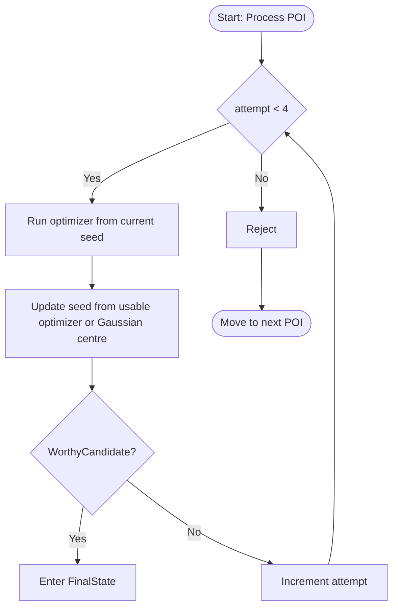

# 21 — NVCandidateVerifier: Repeated Optical Verification

## Status and scope

**Status:** diagnostic implementation available.  This document replaces the
single-attempt proposal in `NVVerifier.md`.  The implementation intentionally
does not yet register, accept, or reject POIs: it collects calibrated evidence
first.

**Planned policy:** the production verifier is a two-stage optimizer-driven
state machine.  Stage 1 runs the optimizer up to four times while updating the
seed after each usable optimizer result, and enters the final state only after
`WorthyCandidate()` passes.  Stage 2 still runs the optimizer; only after each
final-state optimization does it check whether the current POI centre and the
fitted Gaussian centre agree within the configured tolerance.  This matters
because several optimizer passes may be needed before the approximate
extracted POI converges to the actual NV-like fluorescent spot.

`NVCandidateVerifier` is the asynchronous diagnostic bridge from
`POIExtractor` to `OptimizerLogic`.  It collects repeated evidence that a
candidate is a **reproducibly localizable fluorescent spot** before any future
POI-registration policy is enabled.  It does **not** establish that a spot is
a single emitter or that it is an NV-minus centre: ODMR and HBT are explicitly
out of scope for version 1.

This distinction must be visible in the UI, logs, and result types.  The
result `optically_verified` means "repeatable optical localization passed the
configured gates", not "single NV confirmed".

## Why the previous plan is insufficient

The original one-pass plan would reject a candidate after a single refocus,
fit-quality test, and displacement test.  That is not robust enough for a
living-cell/confocal workflow:

1. Focus, count rate, and localization vary with drift and acquisition noise;
   a one-shot failure is weak evidence.  Repeated localization and its spread
   are a direct stability measurement.
2. The current `OptimizerLogic.sigRefocusFinished` payload is only
   `(caller_tag, [x, y, z, 0])`.  It does **not** return R2, fit success,
   sigma, residuals, or an error code.  The verifier cannot truthfully apply
   an R2 gate until that result contract exists.
3. The optimizer currently falls back to the initial position on a failed XY
   fit.  A small displacement alone can therefore look successful even when
   there was no valid fit.
4. A fixed 1 um displacement limit has no defensible meaning for the current
   optimizer.  Its nominal default XY window is 0.6 um, but the legacy fitter
   is permitted to extrapolate outside its sampled window and the code does
   not enforce a local-window limit.  The verifier must use the *actual
   sampled coordinates* and calibration data; it must not reject on a fixed
   1 um seed displacement.
5. A shared caller tag such as `auto_nv_finder` is unsafe for a queued module:
   completion signals need a per-attempt correlation token, and the signal
   must be connected once for the lifetime of the verifier.
6. POI names based on a queue index change when ranking, retry policy, or
   candidate filtering changes.  They are not stable experiment identifiers.

The revised design treats a failed observation as one piece of evidence.  It
does not reject a normal candidate until the configured optimizer budget for
the active stage has been completed and recorded.

## Evidence behind the repeated-measurement policy

Repeated localization is deliberately part of the decision, not just a retry
mechanism.  Published NV work repeats Gaussian PSF fits and uses the standard
error of fitted centres as localization precision; it also distinguishes
multiple centres within a single diffraction-limited bright site using
independent optical and spin measurements.  See [Kehayias et al., *npj
Quantum Information* (2019)](https://www.nature.com/articles/s41534-019-0154-y)
(especially its repeated Gaussian-fit localization and its cluster/single-NV
comparison).  Drift of the focal spot relative to an NV is a known source of
count-rate variation and motivates repeated tracking rather than a single
measurement; see [Ferrie et al., *New Journal of Physics*
(2018)](https://doi.org/10.1088/1367-2630/aa9c9f).

For the scientific interpretation, fluorescence imaging alone cannot prove a
single emitter: HBT provides photon-statistics evidence, and ODMR provides
spin-resonance evidence.  The existing project roadmap documents these as
future validation stages in [13 — Validation Steps](13_validation_steps.md).

## Inputs, outputs, and ownership

```text
POIExtractionResult.strong_candidates
                 |
                 v
       NVCandidateVerifier (one candidate and one optimizer attempt at a time)
                 |                         |
                 |                         +--> OptimizerLogic
                 |
                 +--> VerificationBatchResult + per-attempt audit records
                 |
                 +--> PoiManagerLogic.add_poi() for optically verified spots only
```

### Inputs

- `POIExtractionResult.strong_candidates` (a list of `POICandidate` objects).
- The close-scan/ROI identity and its immutable scan timestamp or run ID.
- Configured optical gates and retry policy.

Marginal candidates remain outside the default batch.  A future time-budgeted
mode may submit them after strong candidates, but must mark the policy in the
batch result.

### Output data model

The implementation should use dataclasses rather than dictionaries at module
boundaries:

```python
@dataclass(frozen=True)
class OptimizerAttemptResult:
    attempt_id: str
    candidate_id: str
    stage: str                   # stage1 | final_state
    attempt_number: int
    seed_position: tuple[float, float, float]
    optimized_position: tuple[float, float, float] | None
    gaussian_center_xy_m: tuple[float, float] | None
    poi_center_xy_m: tuple[float, float] | None
    next_seed_position: tuple[float, float, float] | None
    completed_at: datetime
    elapsed_s: float
    outcome: str                 # passed | failed_gate | timeout | hardware_error
    fit_success_xy: bool | None
    fit_success_z: bool | None
    r_squared_xy: float | None
    r_squared_z: float | None
    sigma_xy_m: tuple[float, float] | None
    sigma_z_m: float | None
    displacement_xy_m: float | None
    poi_gaussian_distance_xy_m: float | None
    worthy_candidate: bool | None
    final_state_fit: bool | None
    gate_failures: tuple[str, ...]
    optimizer_error: str | None


@dataclass
class CandidateVerificationResult:
    candidate: POICandidate
    attempts: list[OptimizerAttemptResult]
    status: str                  # optically_verified | rejected | unresolved | skipped
    consensus_position: tuple[float, float, float] | None
    stage1_attempts: int
    final_state_attempts: int
    localization_spread_xy_m: float | None
    rejection_reason: str | None
    poi_name: str | None


@dataclass
class VerificationBatchResult:
    run_id: str
    policy_snapshot: dict
    candidates: list[CandidateVerificationResult]
    started_at: datetime
    finished_at: datetime | None
```

`unresolved` is intentionally separate from `rejected`.  Hardware failure,
optimizer unavailability, cancellation, or an absent result payload must not
be presented as evidence against the candidate.

The full result is emitted and persisted as a versioned JSON sidecar (or a
SaveLogic-supported structured artifact) tied to `run_id`.  `PoiManagerLogic`
only persists POI name and position, so it cannot be the sole audit store.

## Required optimizer result contract

Before the verifier is implemented, extend `OptimizerLogic` with a new signal
or result object.  Keep the existing `sigRefocusFinished(str, list)` unchanged
for compatibility.

```python
sigRefocusResult = QtCore.Signal(str, object)

@dataclass(frozen=True)
class RefocusResult:
    caller_tag: str
    initial_position: tuple[float, float, float]
    optimized_position: tuple[float, float, float]
    gaussian_center_xy_m: tuple[float, float] | None
    poi_center_xy_m: tuple[float, float] | None
    xy_fit_success: bool
    z_fit_success: bool
    xy_r_squared: float | None
    z_r_squared: float | None
    sigma_x_m: float | None
    sigma_y_m: float | None
    sigma_z_m: float | None
    sampled_xy_bounds_m: tuple[float, float, float, float]
    xy_center_on_boundary: bool
    z_center_on_boundary: bool
    error_code: str | None
```

R2 is calculated from the **raw optimizer scan data** and its fitted model
(`1 - SSE/SST`), with `None` when SST is zero or a fit was not completed.  Fit
success, boundary hits, and sigmas are separate signals of quality; R2 alone
must never be used as an oracle.  The optimizer must set explicit failure
flags before it replaces a failed fit with the initial position.

For the final-state 50 nm gate, the result must expose the fitted Gaussian
centre separately from the current POI/scanner centre.  If those are the same
coordinate in a future optimizer implementation, that equality should be
explicit in the result object rather than inferred from the legacy
`[x, y, z, 0]` payload.

Until this contract is available, the verifier may run in a diagnostic mode
only: it records positions and marks the outcome `unresolved`; it must not
silently substitute a displacement-only acceptance rule.

## Critical optimizer audit: displacement must not gate v1

This audit was performed against this workspace's legacy
`logic/optimizer_logic.py` and `logic/fitmethods/gaussianlikemethods.py` on
2026-07-14.  It explains the reported manual behaviour: clicking the apparent
maximum can fail, while a nearby click succeeds.  Source inspection identifies
real defects and plausible sampling effects, but it cannot prove which one
occurred in a particular manual run without the raw optimizer images and fit
results.

### What the available Confocal2 data can and cannot establish

`Confocal2` does contain the available close-cell scans: each is a 200 x 200
confocal image with physical X/Y coordinates and count rates.  These scans are
appropriate for replaying local Gaussian fits, checking that a fitter respects
sampled support, and exercising candidate-window diagnostics.  They are **not**
optimizer scans: the repository has no saved sequence of repeated sub-micron
XY/Z optimizer windows at the same POI, nor the associated fit results and
timestamps.  Consequently, this data cannot decide whether an apparent
movement during manual optimization was caused by physical motion, drift, or
the legacy optimizer.

The isolated module `logic/optimizer2.py` is the offline replay path for this
data.  It does not drive hardware and does not change `OptimizerLogic`.  It
fits only inside the acquired coordinate support, returns a structured result,
and records an edge flag instead of extrapolating a maximum.  Its tests replay
the three current close-cell scans (`1701-46`, `1724-08`, and `1833-28`) in
addition to synthetic centred and edge-peak cases.  These are regression and
safety tests, not proof that a fitted spot is a real NV.

For a deliberately conservative smoke test, fitting the brightest pixel in a
local one-third-FOV window produced bounded numerical fits with R2 values of
about 0.098, 0.050, and 0.050 respectively.  Those values are **not** a
quality benchmark: these are broad close-cell images, not labelled isolated
sub-micron optimizer windows.  They confirm that replay is technically
possible, while also confirming that this corpus must not be used to select an
automatic R2 acceptance threshold.

### Verified code facts

1. The default nominal XY search is 0.6 um with 10 points per axis.  Its pitch
   is `refocus_XY_size / (optimizer_XY_res - 1)` = about 66.7 nm.  Because 10
   is even, the seed/crosshair coordinate is **not sampled**: the samples are
   -300, -233.3, ..., -33.3, +33.3, ..., +300 nm relative to the seed.  An
   odd resolution samples the seed.  This alone does not prove a failed fit,
   but it changes the grid phase when an operator clicks nearby and is a
   credible hypothesis for the observed effect.
2. The XY scan is clipped at the hardware travel range.  Thus the actual
   window can be asymmetric and smaller than `refocus_XY_size`; its bounds are
   `min(_X_values)`, `max(_X_values)`, `min(_Y_values)`, and `max(_Y_values)`,
   not the requested status variable.
3. The Gaussian fitter calculates its parameter bounds from flattened arrays
   incorrectly.  For X, `n_steps` is 100 (the flattened 10 x 10 image), not
   10; with the unclipped 0.6 um default, it permits a fitted X centre about
   -6.97 to +6.97 um from the seed.  For Y, the first two flattened values are
   identical, so `stepsize_y` is zero; this leaves Y constrained only to the
   sampled range and gives it a zero lower sigma bound.  This strong X/Y
   asymmetry is another implementation defect.  The optimizer only checks the
   *global hardware* range afterward, not a correctly derived local window.
4. `_max_offset` is assigned the unitless value `3.`.  The scanner interface
   requests SI units, the NI implementation documents metres, and this
   optimizer's own default XY size is `0.6e-6`; therefore this behaves as a
   3 m threshold, not a meaningful local limit.  In addition, the XY
   acceptance condition compares the X displacement twice and never compares
   Y displacement.  These are implementation defects, not calibrated physics.
5. On an XY fit failure, the optimizer silently returns the initial XY
   position and zeros the XY sigmas; `sigRefocusFinished` does not carry the
   failure state.  A zero displacement can therefore mean either "already at
   the maximum" or "fit failed".
6. The MLE initializer is calculated from raw counts, including the flat
   background.  In a low-contrast or uneven-background cell image this can
   bias the starting centre toward the scan-window centre before nonlinear
   fitting.

The modern Qudi optimizer takes a safer direction: it stores fit objects,
stops the sequence on a failed fit, and defaults to at least 16 scan samples
per axis.  See [current Qudi scanning optimizer source](https://qudi-iqo-modules.readthedocs.io/en/sphinx_doc/_modules/qudi/logic/scanning_optimize_logic.html).
This is corroboration of the engineering direction, not a drop-in fix for
this Qudi version.

### Decision for NVCandidateVerifier v1

**Do not use seed displacement as an acceptance or rejection gate.**  In this
codebase it is not evidence that a fit stayed inside a real search area, and
it can reject real POIs because of an optimizer/grid-phase defect.  For each
attempt, the verifier must instead record:

- the immutable candidate seed;
- requested XY size and resolution;
- the actual `X_values`/`Y_values` bounds and pitch after clipping;
- fitted centre, sigmas, fit success, and fit quality;
- whether the centre is outside the sampled support or within a configurable
  edge margin; and
- the complete raw optimizer image or a durable reference to it.

An extrapolated/edge result is `outside_sampled_window` and triggers the next
attempt plus diagnostic capture.  It is **not** a final candidate rejection.
After the configured stage budget, a candidate affected by this condition is
`unresolved_optimizer_window`, not `rejected`, until the calibration below
shows that the behaviour is understood and bounded.

### Real motion, drift, and photophysics are separate hypotheses

Do not assume that a changed optimized coordinate proves an optimizer bug.

- An NV defect embedded in a stationary bulk diamond is lattice-bound; it is
  not expected to diffuse at normal imaging conditions.  The relevant motion
  can instead be motion of the **host nanodiamond**, sample, or optical focus.
- Nanodiamonds inside living cells can translate and rotate.  Individual NV
  nanodiamonds have been tracked in living HeLa cells using their spin spectra
  as identifiers ([McGuinness et al., *Nature Nanotechnology*
  (2011)](https://www.nature.com/articles/nnano.2011.64)).
- Confocal stage/focus drift can arise from temperature-related mechanical
  motion ([Adler and Pagakis, *Journal of Microscopy*
  (2003)](https://doi.org/10.1046/j.1365-2818.2003.01160.x)).
- Brightness can change without physical translation.  In small nanodiamonds,
  surface/charge effects can produce NV-minus/NV-zero conversion and blinking
  ([Liu et al., *Nanoscale* (2020)](https://pubs.rsc.org/en/content/articlehtml/2020/nr/d0nr05931e)); some fluorescent nanodiamond preparations are much more
  photostable, so this must be measured for the actual sample rather than
  assumed.

The future live calibration must therefore acquire a stationary fiducial (or
fixed nanodiamond) and the candidate in an interleaved sequence.  A common
motion of both is instrument/sample drift; candidate-only motion is consistent
with host-particle motion or a fit/photophysics problem; changing intensity
without a stable fitted centre is a photophysics/fit-quality warning.  These
remain hypotheses until a controlled run records them.

### Required controlled experiment before automatic displacement gating

Run this on a stable, isolated bright reference (not a cell candidate) and
save every raw XY optimizer image, full fit report, start coordinate, final
coordinate, actual scan bounds, resolution, clock rate, and hardware limits.

1. Fix the physical spot.  Use the same XY range and dwell settings intended
   for NVCandidateVerifier.
2. For resolutions 10, 11, and at least 16, run three or more repeats from
   the exact fitted position and from a symmetric grid of small known seed
   offsets.  Include offsets of zero and approximately half the current pitch
   in both axes.  An odd resolution tests whether sampling the seed removes
   the effect; the 16-point run compares the legacy default with the newer
   Qudi sampling floor.
3. Repeat the matrix near a hardware travel boundary, where clipping changes
   the actual window.  Label these separately; they must not be pooled with
   the centred-window data.
4. Inspect the optimizer heatmaps and fitted centres, not just the final
   scanner coordinate.  Classify every run as fit success, fit failure,
   outside-sampled-window, boundary-clipped, or hardware error.
5. Only if the result is position- and resolution-stable on this reference may
   a production verifier enable a calibrated displacement diagnostic.  Its
   limit must be validated against the reference's measured repeatability and
   the *actual* scan support.  Otherwise retain the `unresolved` disposition
   and repair the optimizer first.

Confocal PSF fitting requires sufficient spatial sampling; pixel size,
signal-to-noise, and PSF width all affect localization precision.  This makes
the resolution matrix a measurement requirement rather than cosmetic tuning;
see [Descloux et al., *Quality assessment in light microscopy*
(2022)](https://pmc.ncbi.nlm.nih.gov/articles/9526251/) and [Thompson et al.,
*Precise nanometer localization analysis* (2002)](https://pubmed.ncbi.nlm.nih.gov/11964263/).

### Future optimizer repair checklist

Before turning the optional displacement diagnostic into a reject gate:

1. Replace `_max_offset = 3.` with a named, unit-bearing local policy derived
   from actual sampled bounds; check X and Y independently.
2. Constrain or explicitly flag any fitted centre outside the acquired XY
   coordinates; do not treat extrapolation as a localized maximum.
3. Emit a structured result containing XY/Z fit success, raw and/or persisted
   scan data, fit parameters, goodness-of-fit, sampled bounds, and failure
   reason.  Keep `sigRefocusFinished` unchanged for existing callers.
4. Make failed fits terminal for that attempt rather than silently returning
   the seed as an apparently valid optimum.
5. Add synthetic tests for a centred peak, sub-pixel peak, offset peak,
   background gradient, edge peak, clipped window, failed fit, and the former
   missing-Y-offset condition.
6. Re-run the controlled experiment and document the calibrated limits before
   enabling any automated displacement rejection.

## Candidate protocol: staged optimizer verification

### Configuration policy

| Parameter | Initial value | Meaning |
|---|---:|---|
| `stage1_max_attempts` | 4 | Maximum optimizer attempts before a candidate is rejected as not worthy. |
| `stage2_max_attempts` | 5 | Maximum final-state optimizer attempts before rejecting the POI. |
| `update_seed_after_optimizer` | `True` | The next optimizer attempt starts from the last usable optimized/Gaussian centre. |
| `worthy_sigma_xy_range_m` | `(0.05e-6, 0.4e-6)` | Accepted lateral Gaussian sigma range for `WorthyCandidate()`. |
| `worthy_min_xy_r_squared` | `0.6` | Minimum XY Gaussian fit R2 for `WorthyCandidate()`. |
| `poi_gaussian_center_tolerance_m` | `50e-9` | Final-state tolerance for `centre(POI) == centre(Gaussian)`. |
| `candidate_timeout_s` | setup-specific | Watchdog deadline for one optimizer attempt. |
| `edge_margin_px` / support margin | calibrated | Rejects or retries fits at the sampled-window boundary. |

These values are **not** universal NV constants.  The 50-400 nm sigma band is
a practical plausibility range for a diffraction-limited confocal spot in this
setup: it rejects delta-like hot pixels and broad cell/background structures,
while leaving room for optical alignment, pixel pitch, and nanodiamond size.
The `R2 > 0.6` floor is intentionally a future gate on raw optimizer Gaussian
fits, not a claim that the current diagnostic calibration run already passes.
The 2026-07-16 verifier data had 96 attempts, 88 bounded re-analyses marked as
edge fits, R2 from about 0.043 to 0.763, only one attempt above 0.6, and no
attempt satisfying both `R2 > 0.6` and the sigma band.  That run supports the
need for the staged policy, but not automatic acceptance yet.

In particular, no `max_seed_offset_xy_m` acceptance/rejection gate is enabled
in v1.  Once the optimizer defects below are repaired and a calibration
experiment has passed, an optional displacement *diagnostic* may be added.  It
must be derived from the actual XY coordinates acquired for that attempt, not
from a hard-coded 1 um value or merely from `refocus_XY_size`.

### `WorthyCandidate()`

`WorthyCandidate()` is the Stage 1 gate evaluated after an optimizer attempt
returns a structured XY Gaussian fit:

```text
WorthyCandidate :=
    fit_success_xy
    AND gaussian_center_inside_sampled_support
    AND not edge_fit
    AND 0.05 um <= sigma_x <= 0.4 um
    AND 0.05 um <= sigma_y <= 0.4 um
    AND R2_xy > 0.6
```

The sigma values are Gaussian standard deviations, not FWHM.  If only one
effective lateral sigma is reported, it must be derived from the fitted
`sigma_x` and `sigma_y` by a documented rule such as geometric mean; the raw
axis values should still be persisted.  R2 is calculated from the raw
optimizer scan and fitted model.  A malformed payload, missing R2, failed fit,
or edge/out-of-support centre is a failed attempt, not a worthy candidate.

### Stage 1: candidate-to-worthy loop

For each candidate, initialise `current_seed = (x, y, z_estimate)` from
`POIExtractor`.  Every optimizer attempt uses a unique correlation tag, for
example `nvverify:<run_id>:<candidate_id>:s1a<attempt_number>`, and runs a
full optimizer pass from `current_seed`.



Seed update is deliberate.  The POI extracted from the close scan is an
approximate starting point; repeated optimizer attempts are allowed to walk
toward the actual NV-like spot.  The update must still be auditable: persist
the previous seed, optimizer returned position, Gaussian centre, fit metrics,
and chosen next seed for every attempt.  If the optimizer result is malformed
or has no finite centre, keep the previous seed and record the failed update.

### Stage 2: final-state convergence loop

FinalState is not a passive check.  It still runs the optimizer, because
several optimization attempts may be needed before the current POI centre has
actually converged to the Gaussian centre of the fluorescent spot.

```mermaid
graph TD
    E[Enter FinalState] --> I{attempt < 5}
    I -- Yes --> J[Run optimizer from current seed]
    J --> U[Update current POI centre and seed]
    U --> K{Fits? centre(POI) == centre(Gaussian)}
    K -- Yes --> L[Add to POIManager]
    L --> H([Move to next POI])
    K -- No --> M[Increment attempt]
    M --> I
    I -- No --> N[Reject POI]
    N --> H
```

`Fits?` is evaluated only after the final-state optimizer attempt completes.
It requires the same basic fit hygiene as `WorthyCandidate()` plus a centre
agreement check:

```text
Fits :=
    fit_success_xy
    AND gaussian_center_inside_sampled_support
    AND not edge_fit
    AND 0.05 um <= sigma_x <= 0.4 um
    AND 0.05 um <= sigma_y <= 0.4 um
    AND R2_xy > 0.6
    AND distance_xy(centre(POI), centre(Gaussian)) <= 50 nm
```

Here `centre(POI)` means the current optimizer-set POI/scanner centre after
that attempt, while `centre(Gaussian)` is the centre fitted from the raw XY
optimizer image.  If the current implementation cannot expose both values
separately, the result contract must be extended before this gate is enabled.
On success, register the POI with `PoiManagerLogic` at the fitted Gaussian
centre or an explicitly documented consensus derived from the successful
final-state attempt.

No physical call is blocking.  The state machine is driven by queued Qt
signals and timers, so the Qudi event loop remains responsive.

### Decision rule

- **Optically verified:** Stage 1 has produced a worthy candidate, and Stage 2
  has produced a final-state fit where the POI centre and Gaussian centre
  agree within 50 nm.  Register the resulting centre in `PoiManagerLogic`.
- **Rejected:** Stage 1 exhausts four optimizer attempts without
  `WorthyCandidate()`, or Stage 2 exhausts five optimizer attempts without
  `Fits()`.  Record the full failure distribution, not merely `rejected`.
- **Unresolved:** timeout, hardware error, aborted optimizer, malformed or
  unmatched completion, unavailable quality payload, or missing separate POI
  and Gaussian centres prevents an evidence-based decision.  Do not register a
  POI and do not count it as a negative optical observation.

The verifier may finish early only on success.  It does **not** finish early
in rejection: a candidate receives the configured stage budget before being
rejected.  This policy is intentionally conservative with false negatives.

### Optional Step 3: duplicate/deconfliction check

After optical consensus and before POI registration, perform an optional
spatial deconfliction check against (a) previously verified candidates in the
same batch and (b) existing POIs in the same ROI.  The merge radius must be
derived from the calibrated localization uncertainty and physical PSF, not a
pixel count.  A duplicate is `unresolved_duplicate` for review by default;
the verifier must never overwrite or silently rename an existing POI.

This is optional because a project may want nearby but distinct emitters.  It
is not a substitute for HBT/ODMR where two emitters remain diffraction-limited.

## State machine and concurrency

```text
IDLE
  -> BATCH_STARTING -> CANDIDATE_STARTING -> STAGE1_ATTEMPT_RUNNING
  -> STAGE1_EVALUATING -> CANDIDATE_STARTING        (another Stage 1 attempt)
  -> FINAL_STATE_STARTING -> STAGE2_ATTEMPT_RUNNING
  -> STAGE2_EVALUATING -> FINAL_STATE_STARTING      (another Stage 2 attempt)
  -> DECONFLICTING -> REGISTERING -> CANDIDATE_STARTING
  -> BATCH_FINISHED -> IDLE

STAGE1_ATTEMPT_RUNNING -> ATTEMPT_TIMEOUT -> CANDIDATE_UNRESOLVED
STAGE2_ATTEMPT_RUNNING -> ATTEMPT_TIMEOUT -> CANDIDATE_UNRESOLVED
any active state -> STOP_REQUESTED -> CANCELLING -> BATCH_FINISHED
```

Only one verifier owns the optimizer at a time.  Before starting, it must
verify `optimizer.module_state() == 'idle'`; a busy optimizer produces a
deferred/retryable batch-start condition, not a fabricated candidate failure.
The verifier connects once during activation to `sigRefocusResult` using a
queued connection, filters by the unique tag, and disconnects during
deactivation.  It must never connect/disconnect per candidate.

Timeout handling needs explicit ownership: issue `stop_refocus()`, wait for
the matching terminal result for a short cleanup interval, then mark the
attempt `timeout`.  A late result is retained as diagnostic data but cannot
advance the state machine or register a POI.

## POI naming convention

Use an immutable, context-rich name rather than a candidate rank:

```text
NV_<roi-slug>_<region-slug>_<candidate-token>
example: NV_diamond1_R012_a1b2c3
```

- `roi-slug`: lower-case ROI name sanitised to `[a-z0-9-]`, or `roi` if
  absent.
- `region-slug`: `POICandidate.region_id`, sanitised, or `R000` if absent.
- `candidate-token`: stable token from `candidate_id` (the extractor's UUID
  suffix), not the ranked list index.

`PoiManagerLogic.add_poi(position, name=...)` already rejects duplicate names.
On collision, append a deterministic `-02`, `-03`, … suffix and record both
the base and final names in the result.  Do not alter the global
`poi_nametag`, which is a user/ROI setting and would leak automation policy
into manual POI creation.

The name says `NV` for workflow familiarity, while the saved verification
status remains `optically_verified`.  If that terminology could be confused
with ODMR confirmation in the lab, configure the prefix to `FL_` (for
fluorescent localization) until the future spin-validation stage promotes it.

## Qudi module surface

The diagnostic implementation is `logic/nv_candidate_verifier.py`. It is a
`GenericLogic` module that owns Qt signals, hardware activity, cancellation,
and audit persistence. It does **not** modify `logic/optimizer_logic.py`.

```python
optimizerlogic = Connector(interface='OptimizerLogic')
savelogic = Connector(interface='SaveLogic', optional=True)
```

Important public API and signals:

```python
def verify_batch(self, candidates: Sequence[POICandidate], run_context: RunContext) -> str:
    """Start asynchronously and return `run_id`; reject overlapping batches."""

def stop_verification(self) -> None:
    """Cancel after safely accounting for the active optimizer attempt."""

sigVerificationProgress = QtCore.Signal(str, str, int, int)
sigCandidateVerificationUpdated = QtCore.Signal(object)
sigVerificationFinished = QtCore.Signal(object)  # VerificationBatchResult
sigVerificationError = QtCore.Signal(str, str)
```

Use `StatusVar` only for stable user-facing policy values.  Snapshot them into
each `VerificationBatchResult` at start; changes made in the GUI must apply to
the next batch, not halfway through a candidate.

### Implemented diagnostic-only interface (current authority)

The preceding data-model text describes the future gated verifier.  The
currently implemented module is intentionally narrower: it has **no**
`PoiManagerLogic` connector, does not accept/reject or register a POI, and
does not add ODMR.  Add it to the active integrated-hardware configuration as:

```yaml
logic:
    nv_candidate_verifier:
        module.Class: 'nv_candidate_verifier.NVCandidateVerifier'
        remoteaccess: True
        connect:
            optimizerlogic: 'optimizerlogic'
            savelogic: 'savelogic'     # optional, but strongly recommended
```

| Status variable | Default | Role |
|---|---:|---|
| `diagnostic_only` | `True` | Required. Setting it false raises an error; gates cannot silently activate. |
| `minimum_attempts` | 2 | Normal bounded scans before `diagnostic_complete`. |
| `maximum_attempts` | 4 | Retry budget for failed/edge re-analyses. |
| `attempt_timeout_s` | 90 | Watchdog for one legacy optimizer call. |
| `timeout_cleanup_s` | 10 | Extra wait after `stop_refocus()` before writing a terminal timeout audit. |
| `audit_subdirectory` | `NVCandidateVerifier` | SaveLogic module-data directory name. |

Call it asynchronously with `POICandidate` objects (or mappings containing
`candidate_id`, `x`, `y`, and optional `z_estimate`):

```python
run_id = verifier.verify_batch(
    extraction_result.strong_candidates,
    run_context={
        'source_scan': '20260706-1701-46_confocal_xy_data.dat',
        'operator': 'initials',
        'calibration_series': 'seed-offset-r10-r11-r16',
    },
)

verifier.stop_verification()  # optional safe cancellation
```

Every attempt has a distinct caller tag,
`nvverify_<UTC timestamp>_<run token>:<candidate-id>:aNN`; foreign optimizer
completion events cannot advance this batch. The actual public signals are
`sigVerificationProgress`, `sigCandidateVerificationUpdated`,
`sigVerificationFinished`, and `sigVerificationError`.

With SaveLogic connected, each run is retained at:

```text
.../NVCandidateVerifier/nvverify_<timestamp>_<token>/
    manifest.json
    attempt_<candidate-id>_a01.npz
    attempt_<candidate-id>_a02.npz
    ...
```

Without SaveLogic, the fallback is `data/NVCandidateVerifier/` below Qudi's
working directory. The manifest is atomically rewritten after every attempt
and includes run context, optimizer settings, seed, correlation tag, elapsed
time, outcome, legacy returned position/sigmas, and bounded `Optimizer2D`
analysis. The NPZ captures the raw legacy XY scan, actual X/Y coordinates, Z
arrays/line where available, seed, and legacy return. This is the data to
retain and share for later calibration analysis.

`legacy_xy_fit_evidence` is only a diagnostic note. Positive legacy sigmas are
not proof of a valid fit; zero/absent sigmas are explicitly indeterminate
because legacy fallback uses the seed. `optimizer2_xy` is the independent
bounded re-analysis, containing success, R2, sigma, sampled bounds, pitch,
edge flag, or a failure reason.

### Live integrated-hardware calibration procedure

1. Add the configuration above and restart Qudi. Confirm `optimizerlogic`,
   `savelogic`, and the verifier are active. Keep `diagnostic_only=True`; do
   not connect this module to PoiManager.
2. Before cell measurements, select one stable, isolated bright reference.
   Keep laser power, objective, dwell/clock settings, XY/Z ranges, and the
   optimizer sequence fixed per calibration series; write them in
   `run_context`.
3. For legacy resolutions 10, 11, and 16, run batches from seed offsets
   `(0, 0)`, `(+/- half-pitch, 0)`, `(0, +/- half-pitch)`, and several larger
   in-window offsets. In the current diagnostic module, retain the original
   seed for every attempt so seed-offset behaviour can be measured. In the
   future production verifier, enable the documented seed update and persist
   both the previous and next seed for every attempt. Repeat each condition at
   least three times. Label boundary-clipped runs as a separate series.
4. Do not interpret `diagnostic_complete` as POI acceptance. It only means two
   raw scans were independently bounded and were not edge fits. Timeouts, a
   busy optimizer, malformed scans, and exhausted edge/fit budgets remain
   `unresolved`, never rejected.
5. Preserve the complete generated directory. `manifest.json` plus its NPZ
   files can recreate seed-offset, support, fitted-centre, R2, sigma, and
   repeatability plots without changing hardware state.

`tests/test_nv_candidate_verifier.py` verifies bounded raw-scan analysis,
2--4 retry policy, stable IDs, and audit persistence without hardware.
`tests/test_nv_pipeline_integration.py` is the offline Confocal2 visual
replay; it cannot replace live calibration because optimizer subscans were not
stored. Automated gates, POI registration, deconfliction, and ODMR remain
disabled until the calibration data is reviewed.

## Acceptance gates and calibration

The gates should be explicit, individually logged, and initially conservative:

| Gate | Required evidence | Reason |
|---|---|---|
| Fit completion | XY (and Z if Z optimization enabled) reports success | Distinguishes a real fit from the optimizer fallback. |
| Goodness of fit | Calibrated R2 floor and non-degenerate data | Rejects poor Gaussian descriptions, without using R2 alone. |
| Window margin | Fit centre is not on/near an optimizer scan boundary | A boundary maximum suggests the spot was not contained. |
| PSF plausibility | Sigma falls in a calibrated range | Rejects hot pixels and diffuse/clumped structures. |
| Sampled-window support | Centre is inside the actual acquired XY coordinates, with margin | Prevents accepting an extrapolated fit; does not use seed displacement. |
| Seed update audit | Previous seed, optimizer return, Gaussian centre, and next seed are persisted | Makes the optimizer walk toward the actual spot explainable. |
| Final convergence | Current POI centre and Gaussian centre agree within 50 nm after a final-state optimizer run | Confirms the registered POI is centred on the fitted fluorescent spot. |

Calibration must use a labelled set with at least stable single-looking spots,
known clusters/artifacts, and repeats across the intended acquisition period.
Report false-accept/false-reject rates separately for each gate and choose
thresholds on held-out data.  Do not expose the `R2 > 0.6`, 50-400 nm sigma,
or 50 nm final-centre thresholds as scientific guarantees until they are
validated on the intended hardware and sample preparation.

## Failure, stop, and recovery semantics

- **Candidate gate failure:** retain the result and continue its remaining
  attempts; reject only after the configured attempt budget.
- **Optimizer busy at batch start:** leave the batch queued or return a clear
  start error.  Never overwrite another module's signal handling.
- **Timeout/hardware scan failure:** mark that attempt `timeout` or
  `hardware_error`; final status is `unresolved` unless sufficient valid
  evidence still exists.
- **User stop:** stop the active optimizer safely, mark unstarted candidates
  `skipped`, and emit a complete partial batch result.
- **POI registration failure:** keep the optical result as verified but mark
  `registration_failed`; do not rerun optics merely because storage failed.
- **Application restart:** persist each terminal attempt immediately.  A
  resumed batch must not repeat an already registered candidate without an
  explicit operator action.

## Test and verification plan

### Unit tests

Use a deterministic mock optimizer that emits `RefocusResult` asynchronously.

| Test | Expected result |
|---|---|
| Stage 1 worthy on first attempt, Stage 2 fits on first attempt | Optical verification and one POI registered at the fitted Gaussian centre. |
| Stage 1 needs several optimizer passes before `WorthyCandidate()` | Seed updates are persisted and candidate enters FinalState when the gate passes. |
| Stage 1 four attempts never satisfy `WorthyCandidate()` | Rejected only after attempt four; all failed gates retained. |
| Stage 2 needs several optimizer passes before the 50 nm centre check passes | Accepted when `Fits()` passes; all intermediate centres are retained. |
| Stage 2 five attempts never satisfy `Fits()` | Rejected only after attempt five; no POI is registered. |
| Optimizer fallback position + `xy_fit_success=False` | Fails fit gate even with zero displacement. |
| Missing quality payload | Unresolved; no POI. |
| Timeout and late completion | One timeout record; late event cannot alter state. |
| Foreign caller tag | Ignored. |
| Candidate-specific tags | Results cannot cross-contaminate queued candidates. |
| Missing separate POI centre and Gaussian centre in FinalState | Unresolved; the 50 nm check cannot be fabricated from one coordinate. |
| Existing-POI deconfliction | No overwrite; duplicate disposition recorded. |
| Name collision | Deterministic suffix and audit record. |
| Stop during active attempt | Safe cancellation, unstarted candidates skipped. |

### Integration tests

1. Add the optimizer result contract and test it against synthetic XY/Z data
   with known Gaussian parameters, fit failures, and edge maxima.
2. Run a batch on a stable calibration target; confirm repeated centres and
   aggregate spread agree with manual inspection.
3. Run on archived close-scan data with injected optimizer outcomes; review
   overlays, result JSON, and POI registration names.
4. Run on live hardware only after the timeout/stop path has been exercised
   under supervision.

### Current close-cell replay integration test

`tests/test_nv_pipeline_integration.py` replays all three current close-cell
scans in `Confocal2` (`20260706-1701-46`, `20260706-1724-08`, and
`20260706-1833-28`) through this offline chain:

```text
CellSegmentationLogic.parse_dat_file
    -> CellRegionProcessor
    -> POIExtractor
    -> Optimizer2D
```

It deliberately does **not** instantiate the legacy hardware-driving
`OptimizerLogic`.  For each scan it writes a combined PNG overlay, a JSON
result record, and a CSV table of candidate/fit metrics to
`tests/output_visuals/nv_pipeline_integration/`.  The integration assertions
verify that the processable zone and candidates exist, and that every
successful `Optimizer2D` fit lies inside its actual sampled bounds.  The
generated R2 values remain diagnostics, not acceptance thresholds.

## ODMR and future validation

ODMR is not included in this module version.  Preserve an extension point
after `optically_verified` and before a future status promotion, but do not
add an ODMR connector, status variables, scan calls, or ODMR-derived names
now.  A future `NVSpinVerifier` can consume the registered POI and emit a
separate `odmr_verified` status.  HBT remains the appropriate future evidence
for the single-emitter claim.

## Implementation order

1. Repair and test the optimizer issues in the critical audit, then run the
   controlled seed-offset/resolution experiment.
2. Add and test the backwards-compatible optimizer result contract.
3. Add explicit result fields for optimizer return position, Gaussian centre,
   fit success, R2, sigma, sampled support, and edge status.
4. Implement the verifier data classes, one-time signal connection, watchdog,
   Stage 1 `WorthyCandidate()` loop, seed-update audit, and Stage 2
   final-state convergence loop.
5. Add audit persistence, `PoiManagerLogic` registration on `Fits()`, and the
   stable naming helper.
6. Add deconfliction only after its merge radius is calibrated.
7. Calibrate gates, then wire the verifier into the multi-scale master task.

Do not replace the existing `AutoNVFinderLogic` one-pass path until the new
module passes its mock and calibration tests.  The old path can remain a
legacy single-scan convenience feature while this verifier becomes the
downstream stage for `POIExtractor`.

## Decisions made

| Topic | Decision |
|---|---|
| ODMR in v1 | Excluded. |
| HBT in v1 | Excluded. |
| Stage 1 attempts | Run optimizer up to four times; enter FinalState only when `WorthyCandidate()` passes. |
| Stage 2 attempts | Run optimizer up to five more times; then check POI centre vs Gaussian centre after each attempt. |
| Seed update | Enabled in the planned verifier; persist previous seed, optimizer return, Gaussian centre, and chosen next seed. |
| Rejections | Only after the active stage exhausts its attempt budget; no one-shot gate rejection. |
| Success | `WorthyCandidate()` in Stage 1 plus `Fits()` in Stage 2; add the accepted centre to `PoiManagerLogic`. |
| Failed hardware/timeout | `unresolved`, not rejected. |
| WorthyCandidate | Requires fit success, sampled-support check, no edge fit, 50-400 nm XY sigma, and `R2 > 0.6`. |
| Final centre tolerance | `distance_xy(centre(POI), centre(Gaussian)) <= 50 nm` after a final-state optimizer attempt. |
| R2 | Requires raw optimizer scan/model evidence in the optimizer result contract; no inferred R2 from legacy return alone. |
| Seed displacement | Diagnostic only in v1; current optimizer defects make it unsafe as a gate. |
| POI name | Stable `NV_<roi>_<region>_<candidate-token>`, not a list index. |
| Audit trail | Persist every attempt outside POI Manager. |
