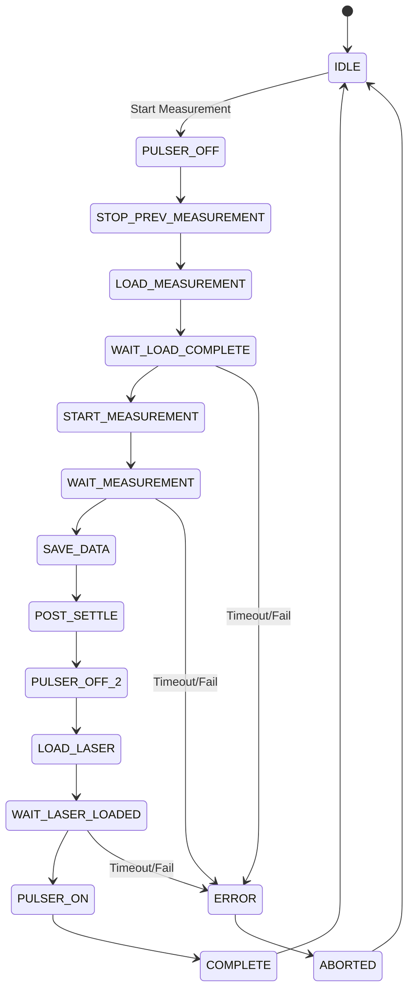

# Pulsed Measurement Executor

## Overview

The `PulsedMeasurementExecutor` is a critical logic module in the Qudi NV automation pipeline. Its primary purpose is to automate execution of complex pulsed experiments (such as T1 relaxometry or pulsed ODMR) on individual NV center candidates that have been previously optically verified by the `NVCandidateVerifier`.

By abstracting the complexity of orchestrating the `PulsedMasterLogic` and interacting with the signal generator/pulser hardware, this module provides a simple `execute_measurement(parameters)` interface for the high-level automation orchestrator.

## Architecture

The module is designed around an asynchronous, non-blocking state machine. This allows the Qudi GUI to remain responsive while waiting for long-running pulsed experiments to complete.

### State Machine Design

The execution of a single pulsed measurement follows a strict sequence of states. A dedicated method `_advance_state()` evaluates the current state and triggers the next operation, relying on Qt signals and timers for asynchronous progression.



**State Descriptions:**
1. **IDLE**: Waiting for a new measurement request.
2. **PULSER_OFF**: Ensures microwave/RF pulser outputs are disabled before configuring the experiment.
3. **STOP_PREV_MEASUREMENT**: Explicitly commands `PulsedMasterLogic` to stop any currently running or lingering tasks.
4. **LOAD_MEASUREMENT**: Sends the configured measurement parameters (e.g., tau delays, sweep arrays) to the `PulsedMasterLogic`.
5. **WAIT_LOAD_COMPLETE**: Asynchronously waits for `PulsedMasterLogic` to confirm compilation and loading of the pulse sequence onto the AWG/Pulse Streamer.
6. **START_MEASUREMENT**: Triggers the execution of the loaded pulse sequence.
7. **WAIT_MEASUREMENT**: Asynchronously waits for the measurement to complete. This state can last anywhere from seconds to hours depending on averaging.
8. **SAVE_DATA**: Triggers the `PulsedMasterLogic` to save the accumulated data to disk and retrieves the result dictionary.
9. **POST_SETTLE**: Configurable delay to allow hardware buffers to clear and file I/O to complete.
10. **PULSER_OFF_2**: Ensures pulsers are off after the measurement.
11. **LOAD_LASER**: (Optional) Loads a continuous laser sequence for subsequent optical tracking or verification.
12. **WAIT_LASER_LOADED**: Waits for the continuous laser sequence to be loaded.
13. **PULSER_ON**: Enables pulser output (if required by the subsequent sequence).
14. **COMPLETE**: Emits the `sig_measurement_finished` signal and returns to IDLE.

## Signal Flow and Communication

The `PulsedMeasurementExecutor` acts as a client to the `PulsedMasterLogic`. Communication relies heavily on Qudi's Connector framework and Qt Signals.

- **Requests**: `PulsedMeasurementExecutor` calls methods on `PulsedMasterLogic` (e.g., `load_measurement()`, `start()`, `stop()`).
- **Responses**: `PulsedMasterLogic` emits signals (e.g., `sig_sequence_loaded`, `sig_measurement_finished`). `PulsedMeasurementExecutor` connects to these signals to trigger state transitions (`_advance_state()`).

## Error Handling

Robust error handling is essential to prevent the automation pipeline from stalling indefinitely.

- **Timeout Watchdog**: A configurable Qt Timer (e.g., 15 minutes by default) monitors the `WAIT_LOAD_COMPLETE`, `WAIT_MEASUREMENT`, and `WAIT_LASER_LOADED` states. If a state does not complete before the timer expires, the measurement is aborted, and an error signal is emitted.
- **State Correlation**: When receiving signals from `PulsedMasterLogic`, the executor verifies its internal state to ensure it is actually waiting for that specific signal, preventing spurious signal processing.
- **Graceful Abort**: An `abort()` method allows the orchestrator to cancel an ongoing measurement. The state machine transitions to an aborting sequence (stopping hardware) before returning to IDLE.
- **Try/Except**: All hardware interaction calls (via Connectors) are wrapped in `try/except` blocks to catch Qudi connection errors or hardware exceptions, emitting failure signals rather than crashing the thread.

## Integration with Orchestrator

The high-level experiment orchestrator interacts with this module via a simple interface:

1. Connects to `sig_measurement_finished` and `sig_measurement_failed`.
2. Calls `execute_measurement(measurement_type, parameters)`.
3. Handles the result dictionary emitted in `sig_measurement_finished`.

## Configuration

The module utilizes `StatusVar` for persistent configuration and internal state tracking:

- `timeout_s` (float): Maximum time in seconds to wait in a single blocking state (default 900s / 15m).
- `post_settle_s` (float): Delay in seconds during the POST_SETTLE state (default 1.0s).
- `default_laser_sequence` (str): Name of the sequence to load in the LOAD_LASER state (e.g., "CW_Laser").

## Data Structures

The `execute_measurement` method expects a dictionary of parameters, and the `sig_measurement_finished` signal emits a result dictionary.

**Input Parameter Schema (Example):**
```python
{
    "measurement_type": "T1",
    "tau_start": 1e-9,
    "tau_end": 1e-3,
    "tau_points": 50,
    "averages": 100000,
    "microwave_frequency": 2.87e9,
    "microwave_power": -10.0
}
```

**Result Dictionary:**
```python
{
    "success": True,
    "data_path": "C:/qudi_data/2026/08/04/T1_143000.h5",
    "extracted_parameters": {
        "T1_time": 2.5e-3,
        "contrast": 0.25
    },
    "raw_data": <numpy array> # Optional, usually avoid passing large arrays via signals
}
```

## Qudi Config Example

```yaml
logic:
    pulsed_measurement_executor:
        module.Class: 'automation.pulsed_measurement_executor.PulsedMeasurementExecutor'
        connectors:
            pulsed_master: 'pulsed_master_logic'
            microwave_source: 'microwave_sg'
            pulse_generator: 'pulse_streamer'
        kwargs:
            timeout_s: 900
            post_settle_s: 2.0
```
