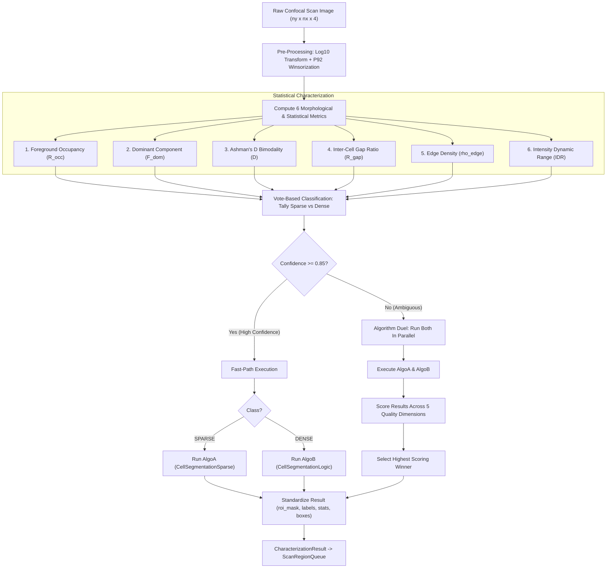

# SampleCharacterizationEngine — Intelligent Pre-Segmentation Algorithm Router (Module 26)

> **Document 26 of the Automation Series**  
> Technical documentation for [`SampleCharacterizationEngine`](file:///d:/qudi-working/qudi/logic/sample_characterization_engine.py): an intelligent, statistical pre-segmentation analyzer and routing engine that classifies confocal macro scans into morphological density regimes and selects or duels the optimal cell segmentation algorithm.

**Related documents:**
- [08 — Cell Segmentation Logic](08_cell_segmentation.md) — Dense sample segmentation (White Top-Hat + Adaptive Thresholding)
- [10 — ROI Segmentation](10_roi_segmentation.md) — Legacy Otsu-based macro segmentation
- [17 — Algorithm Optimization](17_algorithm_optimization.md) — Parameter tuning & benchmarking
- [18 — ScanRegionQueue](18_scan_region_queue.md) — Downstream cell region queue manager
- [20 — POI Extractor Module](20_poi_extractor_module.md) — Cell-level candidate extraction
- [25 — Algorithm Intuitions & Upgrades](25_algorithm_intuitions_and_upgrades.md) — Upgraded segmentation heuristics

**Related source files:**
- [`logic/sample_characterization_engine.py`](file:///d:/qudi-working/qudi/logic/sample_characterization_engine.py) — Core routing & characterization engine
- [`logic/cell_segmentation_sparse.py`](file:///d:/qudi-working/qudi/logic/cell_segmentation_sparse.py) — AlgoA: Sparse sample segmentation
- [`logic/cell_segmentation_logic.py`](file:///d:/qudi-working/qudi/logic/cell_segmentation_logic.py) — AlgoB: Dense sample segmentation
- [`logic/multi_scale_auto_nv_finder_logic.py`](file:///d:/qudi-working/qudi/logic/multi_scale_auto_nv_finder_logic.py#L407) — Pipeline caller
- [`tests/test_sample_characterization_engine.py`](file:///d:/qudi-working/qudi/tests/test_sample_characterization_engine.py) — Unit & integration test suite

---

## 1. Problem Statement

Automated Nitrogen-Vacancy (NV) center localization in diamond-based quantum microscopy begins with wide-field macro scans (e.g. $200 \times 200\,\mu\text{m}^2$). Before dispatching high-resolution confocal scans or pulsed measurement sequences, the pipeline must segment biological cell bodies from the diamond substrate background.

However, real-world biological samples exhibit extreme morphological and optical divergence across experimental runs:

```
┌─────────────────────────────────────────────────────────────────────────────┐
│                             Sample Divergence                               │
├──────────────────────────────────────┬──────────────────────────────────────┤
│ Sparse Samples (Confocal1, Confocal2)│ Dense Samples (Confocal3, Confocal4) │
│ - Well-separated, isolated cells     │ - High cell confluence & 3D overlaps │
│ - Pristine substrate background      │ - Low-lit, faint cellular edges      │
│ - Low foreground fraction (< 20%)    │ - Ultra-bright NV cluster glare      │
│ - High substrate-to-cell contrast    │ - Large foreground fraction (> 35%)  │
└──────────────────────────────────────┴──────────────────────────────────────┘
```

To address these distinct regimes, two specialized segmentation algorithms were developed:

1. **AlgoA — [`CellSegmentationSparse`](file:///d:/qudi-working/qudi/logic/cell_segmentation_sparse.py)**:
   - **Mechanism**: Non-linear Log Transform $\rightarrow$ $P_{92}$ Winsorization $\rightarrow$ Median Absolute Deviation (MAD) noise floor estimation $\rightarrow$ Seeded hysteresis region propagation.
   - **Strength**: Exceptional background rejection on sparse samples. Prevents substrate noise from triggering false-positive cell detections.
   - **Failure Mode on Dense Samples**: Under-segments confluent cell regions; fails to bridge low-contrast boundaries between touching cells, underestimating true cell area.

2. **AlgoB — [`CellSegmentationLogic`](file:///d:/qudi-working/qudi/logic/cell_segmentation_logic.py)**:
   - **Mechanism**: Morphological White Top-Hat filtering $\rightarrow$ Dual-path global-gated local adaptive thresholding $\rightarrow$ Multi-peak distance watershed.
   - **Strength**: Exceptional recovery of faint cell boundaries and separation of overlapping 3D cell clusters in dense, cluttered fields.
   - **Failure Mode on Sparse Samples**: Local adaptive windowing over-sensitizes in dark substrate regions, generating spurious background false positives when cells are sparse.

### The No-Free-Lunch Dilemma

No single static algorithm or fixed parameter set performs optimally across both sparse and dense regimes:

| Sample Dataset | True Morphology | AlgoA (Sparse Engine) | AlgoB (Dense Engine) | Ideal Behavior |
| :--- | :--- | :--- | :--- | :--- |
| **Confocal1** | Single isolated cell | **Clean, tight mask (12%)** | False-positive background noise | **AlgoA** |
| **Confocal2** | 2–4 separated cells | **Accurate boundaries (16%)** | Spurious edge artifacts | **AlgoA** |
| **Confocal3** | Confluent layer, 20+ cells | Under-segmented (misses 40% area)| **Full cell recovery (23%)** | **AlgoB** |
| **Confocal4** | Clustered colonies | Broken/fragmented boundaries | **Accurate 3D separation** | **AlgoB** |

The **[`SampleCharacterizationEngine`](file:///d:/qudi-working/qudi/logic/sample_characterization_engine.py)** solves this dilemma by operating as an intelligent pre-segmentation router: it inspects the raw confocal image statistics, computes six discriminative metrics, and automatically routes execution to the optimal algorithm via a confidence-gated fast path or an empirical multi-dimensional duel.

---

## 2. Architecture & Pipeline

### Pipeline Overview

The engine sits directly before cell segmentation in the Qudi NV automation pipeline:



### Module Location & Entry Point

- **Module**: [`logic/sample_characterization_engine.py`](file:///d:/qudi-working/qudi/logic/sample_characterization_engine.py)
- **Primary Entry Point**:
  ```python
  def characterize_and_segment(image: np.ndarray, min_cell_area_um2: float = 30.0) -> CharacterizationResult:
  ```

### Hybrid Execution Strategy

1. **High Confidence ($\text{Confidence} \ge 0.85$)**:
   - The sample unequivocally belongs to either the `SPARSE` or `DENSE` class (e.g., 5 or 6 metrics agree).
   - The engine triggers the **Fast Path**, executing solely the winning algorithm.
   - Computational overhead is minimal ($\approx 15\,\text{ms}$ for metric extraction).

2. **Low Confidence / Ambiguous ($\text{Confidence} < 0.85$)**:
   - The sample possesses mixed traits (e.g., clustered colonies in an otherwise empty field, or moderate confluence with sharp boundaries).
   - The engine launches an **Algorithm Duel**: both AlgoA and AlgoB are executed on the scan data.
   - The two resulting segmentation masks and instance sets are evaluated against five objective quality criteria.
   - The candidate with the superior composite quality score is selected.

---

## 3. Data Structures

The module relies on strict, decoupled `@dataclass` structures with explicit type annotations:

```python
from dataclasses import dataclass, field
from enum import Enum
from typing import Dict, List, Optional, Tuple, Any
import numpy as np


class SampleClass(Enum):
    """Morphological classification of the sample."""
    SPARSE = "sparse"
    DENSE = "dense"
    AMBIGUOUS = "ambiguous"


class AlgorithmChoice(Enum):
    """Selected segmentation algorithm."""
    ALGO_A_SPARSE = "CellSegmentationSparse"
    ALGO_B_DENSE = "CellSegmentationLogic"


@dataclass(frozen=True)
class SampleMetrics:
    """
    Six quantitative metrics extracted from the pre-processed confocal image.
    """
    foreground_occupancy: float      # R_occ: Fraction of pixels above noise floor
    dominant_component_fraction: float # F_dom: Largest connected component / total foreground
    ashman_d: float                  # D: Histogram bimodality separation
    inter_cell_gap_ratio: float      # R_gap: Mean inter-centroid gap / mean cell diameter
    edge_density: float              # rho_edge: Fraction of high-gradient edge pixels
    dynamic_range_decades: float     # IDR: log10(P99 / P10)
    substrate_noise_sigma: float     # MAD estimated noise floor
    p92_value: float                 # Winsorization intensity cap


@dataclass(frozen=True)
class DuelScore:
    """
    Quality scores evaluated during an algorithm duel.
    """
    coverage_sanity_score: float     # Mask coverage between 5% and 65% (weight: 0.25)
    fg_bg_contrast_score: float      # Foreground-to-background separation contrast (weight: 0.30)
    cell_count_score: float          # Instance count plausibility 1-30 (weight: 0.20)
    instance_regularity_score: float # Area coefficient of variation consistency (weight: 0.15)
    boundary_cleanness_score: float  # Compactness / perimeter smoothness (weight: 0.10)
    total_score: float               # Weighted composite score in [0.0, 1.0]


@dataclass
class CharacterizationResult:
    """
    Comprehensive output of the SampleCharacterizationEngine.
    """
    roi_mask: np.ndarray             # 2D boolean mask (ny, nx)
    component_labels: np.ndarray     # 2D int32 labeled instance mask (ny, nx)
    cell_boxes: List[Dict[str, Any]] # List of bounding box dictionaries for ScanRegionQueue
    sample_class: SampleClass        # SPARSE, DENSE, or AMBIGUOUS
    chosen_algorithm: AlgorithmChoice# Selected algorithm
    confidence: float                # Classification confidence in [0.0, 1.0]
    execution_path: str              # "fast_path" or "duel"
    metrics: SampleMetrics           # Extracted image metrics
    algo_a_score: Optional[DuelScore] = None
    algo_b_score: Optional[DuelScore] = None
    stats: Dict[str, Any] = field(default_factory=dict)
```

---

## 4. Classification Metrics Formulation

All metrics are computed on the non-linearly compressed image $I_{\text{log}}$ after $P_{92}$ Winsorization:

$$I_{\text{clean}}(x, y) = \max(I(x, y), 0)$$

$$I_{\text{log}}(x, y) = \log_{10}(I_{\text{clean}}(x, y) + 1.0)$$

$$I_{\text{win}}(x, y) = \min(I_{\text{log}}(x, y), P_{92}(I_{\text{log}}))$$

Substrate noise standard deviation $\sigma_{\text{noise}}$ is estimated using the Median Absolute Deviation (MAD) of the background baseline:

$$\sigma_{\text{noise}} = 1.4826 \cdot \text{median}\left(\left| I_{\text{win}} - \text{median}(I_{\text{win}}) \right|\right)$$

```
                         Metric Feature Space Separation
                         
   Metric                      Sparse Regime (AlgoA)              Dense Regime (AlgoB)
  ─────────────────────────────────────────────────────────────────────────────────────
   R_occ (Occupancy)          0.00 ─────── [ < 0.30 ] ─────────── [ > 0.30 ] ───── 1.00
   F_dom (Dominant Clump)     0.00 ─── [ < 0.25 ] ──── Ambiguous ─── [ > 0.65 ] ── 1.00
   Ashman's D (Bimodality)    0.00 ────────────── [ < 2.00 ] ──── [ > 2.00 ] ───── 5.00+
   R_gap (Inter-Cell Gap)     0.00 ──── [ < 0.50 ] ── Ambiguous ── [ > 1.00 ] ──── 5.00+
   rho_edge (Edge Density)    0.00 ─── [ < 0.04 ] ─── Ambiguous ─── [ > 0.09 ] ─── 0.20+
   IDR (Dynamic Range)        High Decadic Contrast               Low Decadic Contrast
  ─────────────────────────────────────────────────────────────────────────────────────
```

### 1. Foreground Occupancy Ratio ($R_{\text{occ}}$)
The proportion of scan pixels whose fluorescence significantly exceeds the substrate noise floor:

$$\tau_{\text{occ}} = \text{median}(I_{\text{win}}) + 2.5 \cdot \sigma_{\text{noise}}$$

$$R_{\text{occ}} = \frac{1}{N} \sum_{x, y} \mathbb{I}\left(I_{\text{win}}(x, y) > \tau_{\text{occ}}\right)$$

- **Sparse**: $R_{\text{occ}} < 0.30$ (cells occupy small isolated patches).
- **Dense**: $R_{\text{occ}} \ge 0.30$ (cells cover substantial field area).

### 2. Dominant Component Fraction ($F_{\text{dom}}$)
Evaluates whether foreground pixels form isolated individual entities or a single interconnected confluent network. Given connected components $\{C_1, C_2, \dots, C_k\}$ of the thresholded foreground:

$$F_{\text{dom}} = \frac{\max_{i} |C_i|}{\sum_{i=1}^k |C_i|}$$

- **Sparse**: $F_{\text{dom}} < 0.25$ (no single cell dominates total foreground).
- **Dense**: $F_{\text{dom}} > 0.65$ (a large confluent mesh dominates the field).
- **Ambiguous**: $0.25 \le F_{\text{dom}} \le 0.65$.

### 3. Histogram Bimodality (Ashman's $D$)
Measures the separation between the substrate background distribution and the cell fluorescence distribution. The histogram of $I_{\text{win}}$ is modeled as a two-component mixture with means $\mu_1, \mu_2$ and variances $\sigma_1^2, \sigma_2^2$:

$$D = \sqrt{2} \cdot \frac{|\mu_1 - \mu_2|}{\sqrt{\sigma_1^2 + \sigma_2^2}}$$

- **Sparse**: $D > 2.0$ (clean, bimodal distribution with well-separated background and cell peaks).
- **Dense**: $D \le 2.0$ (unimodal or heavily skewed distribution where cell bodies blend into background).

### 4. Inter-Cell Gap Ratio ($R_{\text{gap}}$)
Quantifies spatial separation relative to object dimensions. For component centroids $\{\mathbf{c}_1, \dots, \mathbf{c}_k\}$ and mean equivalent diameter $\bar{d}_{\text{cell}} = 2 \sqrt{\bar{A} / \pi}$:

$$\bar{d}_{\text{gap}} = \frac{1}{k} \sum_{i=1}^k \min_{j \ne i} \|\mathbf{c}_i - \mathbf{c}_j\|_2$$

$$R_{\text{gap}} = \frac{\bar{d}_{\text{gap}}}{\bar{d}_{\text{cell}}}$$

- **Sparse**: $R_{\text{gap}} > 1.0$ (mean spacing exceeds cell diameter; isolated cells).
- **Dense**: $R_{\text{gap}} < 0.5$ (cells touch or overlap).
- **Ambiguous**: $0.5 \le R_{\text{gap}} \le 1.0$.

### 5. Edge Density ($\rho_{\text{edge}}$)
Fraction of pixels exhibiting high spatial gradients (Sobel operator magnitude $|\nabla I_{\text{win}}|$):

$$\tau_{\text{edge}} = \text{mean}(|\nabla I_{\text{win}}|) + 1.5 \cdot \text{std}(|\nabla I_{\text{win}}|)$$

$$\rho_{\text{edge}} = \frac{1}{N} \sum_{x, y} \mathbb{I}\left(|\nabla I_{\text{win}}(x, y)| > \tau_{\text{edge}}\right)$$

- **Sparse**: $\rho_{\text{edge}} < 0.04$ (mostly smooth substrate; few boundary edges).
- **Dense**: $\rho_{\text{edge}} > 0.09$ (abundant cell contours, texture, and membrane boundaries).
- **Ambiguous**: $0.04 \le \rho_{\text{edge}} \le 0.09$.

### 6. Intensity Dynamic Range ($\text{IDR}$)
Logarithmic span between high fluorescence percentiles ($P_{99}$) and background substrate baseline ($P_{10}$):

$$\text{IDR} = \log_{10}\left(\frac{P_{99}(I_{\text{clean}}) + 1.0}{P_{10}(I_{\text{clean}}) + 1.0}\right)$$

- **Sparse**: High dynamic range with steep foreground drop-off.
- **Dense**: Compressed range due to pervasive autofluorescence.

---

## 5. Summary of Classification Metrics

| Metric | Symbol | Formula | Sparse Criterion | Dense Criterion | Physical Rationale |
| :--- | :---: | :---: | :---: | :---: | :--- |
| **Foreground Occupancy** | $R_{\text{occ}}$ | $\frac{1}{N}\sum \mathbb{I}(I_{\text{win}} > \tau_{\text{occ}})$ | $< 0.30$ | $\ge 0.30$ | Low area coverage indicates isolated objects |
| **Dominant Component** | $F_{\text{dom}}$ | $\frac{\max \|C_i\|}{\sum \|C_i\|}$ | $< 0.25$ | $> 0.65$ | Confluent meshes create giant connected foregrounds |
| **Ashman's Bimodality** | $D$ | $\sqrt{2}\frac{\|\mu_1 - \mu_2\|}{\sqrt{\sigma_1^2 + \sigma_2^2}}$ | $> 2.0$ | $\le 2.0$ | Well-separated peaks signify clean substrate baseline |
| **Inter-Cell Gap Ratio** | $R_{\text{gap}}$ | $\frac{\bar{d}_{\text{gap}}}{\bar{d}_{\text{cell}}}$ | $> 1.0$ | $< 0.5$ | Distance between objects relative to cell size |
| **Edge Density** | $\rho_{\text{edge}}$ | $\frac{1}{N}\sum \mathbb{I}(\|\nabla I\| > \tau_{\text{edge}})$ | $< 0.04$ | $> 0.09$ | Complex multi-cell boundaries produce dense gradient edges |
| **Dynamic Range** | $\text{IDR}$ | $\log_{10}(P_{99} / P_{10})$ | Metric-weighted | Metric-weighted | High contrast vs diffuse autofluorescence floor |

---

## 6. Vote-Based Decision & Routing Logic

Every metric independently evaluates its computed value and casts a discrete vote:

$$v_m \in \{\text{SPARSE}, \text{DENSE}, \text{NEUTRAL}\}$$

```
                Vote Tally & Decision Tree
                
  Metrics: [ M1, M2, M3, M4, M5, M6 ]
             │   │   │   │   │   │
             ▼   ▼   ▼   ▼   ▼   ▼
  Votes:   [ S,  S,  S,  D,  S,  S ]  -->  Votes(Sparse) = 5, Votes(Dense) = 1
  
  Total Non-Neutral Votes = 6
  Majority Class = SPARSE
  Confidence = 5 / 6 = 0.833
  
  Confidence Check: 0.833 < 0.85  ───>  TRIGGER ALGORITHM DUEL
```

### Confidence Calculation

Let $V_S$ be the total votes for `SPARSE`, $V_D$ the votes for `DENSE`, and $V_{\text{valid}} = V_S + V_D$.

$$\text{Majority Class} = \begin{cases} \text{SPARSE}, & \text{if } V_S > V_D \\ \text{DENSE}, & \text{if } V_D > V_S \\ \text{AMBIGUOUS}, & \text{if } V_S = V_D \end{cases}$$

$$\text{Confidence } C = \begin{cases} \frac{\max(V_S, V_D)}{V_{\text{valid}}}, & \text{if } V_{\text{valid}} > 0 \\ 0.50, & \text{otherwise} \end{cases}$$

### Routing Gate

- **If $C \ge 0.85$**: Execute **Fast-Path** with winning algorithm.
- **If $C < 0.85$**: Trigger **Algorithm Duel** (execute both AlgoA and AlgoB, score outputs, select winner).

---

## 7. Algorithm Duel Scoring Framework

When confidence is below $0.85$, both algorithms segment the raw image, and their candidate masks and instance sets are evaluated across five objective scoring dimensions.

```
┌─────────────────────────────────────────────────────────────────────────────┐
│                       Algorithm Duel Quality Scoring                        │
├────────────────────────────────┬─────────┬──────────────────────────────────┤
│ Dimension                      │ Weight  │ Evaluation Criteria              │
├────────────────────────────────┼─────────┼──────────────────────────────────┤
│ 1. Coverage Sanity ($S_{\text{cov}}$)   │ 25%     │ Penalizes masks < 5% or > 65%    │
│ 2. FG/BG Contrast ($S_{\text{con}}$)    │ 30%     │ Standardized signal separation   │
│ 3. Count Plausibility ($S_{\text{cnt}}$)│ 20%     │ Penalizes 0 or > 30 cell count   │
│ 4. Instance Regularity ($S_{\text{reg}}$)│ 15%    │ Low CV of individual cell areas  │
│ 5. Boundary Cleanness ($S_{\text{bnd}}$)│ 10%     │ Isoperimetric quotient / smooth  │
└────────────────────────────────┴─────────┴──────────────────────────────────┘
```

$$S_{\text{total}} = 0.25 S_{\text{cov}} + 0.30 S_{\text{con}} + 0.20 S_{\text{cnt}} + 0.15 S_{\text{reg}} + 0.10 S_{\text{bnd}}$$

### 1. Coverage Sanity ($S_{\text{cov}}$, Weight: 0.25)
Biological cells in a $200 \times 200\,\mu\text{m}^2$ scan typically cover $10\%$ to $45\%$ of the field. Masks covering $< 5\%$ are likely under-segmented; masks covering $> 65\%$ indicate background noise leakage.

$$S_{\text{cov}} = \begin{cases} 
0.0, & \text{if } f_{\text{cov}} < 0.05 \text{ or } f_{\text{cov}} > 0.65 \\
\exp\left( -\frac{(f_{\text{cov}} - 0.25)^2}{2(0.12)^2} \right), & \text{otherwise}
\end{cases}$$

### 2. Foreground / Background Contrast ($S_{\text{con}}$, Weight: 0.30)
Evaluates how cleanly the mask separates bright fluorescence from dark substrate:

$$\text{CNR} = \frac{\mu_{\text{FG}} - \mu_{\text{BG}}}{\sigma_{\text{BG}} + 1.0}$$

$$S_{\text{con}} = \frac{2}{\pi} \arctan\left(\frac{\text{CNR}}{3.0}\right) \in [0.0, 1.0]$$

A clean mask achieves high contrast-to-noise ratio ($\text{CNR} > 5.0$), driving $S_{\text{con}} \to 1.0$.

### 3. Cell Count Plausibility ($S_{\text{cnt}}$, Weight: 0.20)
Expected macro-scan cell counts range from 1 to 30. Zero cells represents total detection failure; counts $> 35$ indicate extreme oversegmentation / noise speckle:

$$S_{\text{cnt}} = \begin{cases} 
0.0, & \text{if } K = 0 \text{ or } K > 40 \\
1.0, & \text{if } 1 \le K \le 25 \\
1.0 - \frac{K - 25}{15}, & \text{if } 25 < K \le 40
\end{cases}$$

### 4. Instance Regularity ($S_{\text{reg}}$, Weight: 0.15)
Biological cell cross-sections in cultured diamond samples have bounded, consistent areas. The coefficient of variation $\text{CV} = \sigma_{\text{area}} / \mu_{\text{area}}$ penalizes fragmentation:

$$S_{\text{reg}} = \begin{cases} 
1.0, & \text{if } K = 1 \\
\exp\left( -0.5 \cdot \text{CV}^2 \right), & \text{if } K > 1
\end{cases}$$

### 5. Boundary Cleanness ($S_{\text{bnd}}$, Weight: 0.10)
Measures the mean isoperimetric circularity quotient $Q = \frac{4\pi A}{P^2}$ across all detected cell boundaries. Smooth, convex boundaries have $Q \approx 0.6 - 0.9$; jagged, noisy pixelated boundaries have $Q < 0.2$:

$$S_{\text{bnd}} = \text{clip}\left(\frac{1}{K}\sum_{i=1}^K Q_i, 0.0, 1.0\right)$$

### Duel Winner Selection

$$\text{Winner} = \begin{cases}
\text{AlgoA (CellSegmentationSparse)}, & \text{if } S_{\text{total}}(\text{AlgoA}) \ge S_{\text{total}}(\text{AlgoB}) \\
\text{AlgoB (CellSegmentationLogic)}, & \text{if } S_{\text{total}}(\text{AlgoB}) > S_{\text{total}}(\text{AlgoA})
\end{cases}$$

---

## 8. Integration into MultiScaleAutoNVFinderLogic

[`SampleCharacterizationEngine`](file:///d:/qudi-working/qudi/logic/sample_characterization_engine.py) seamlessly replaces the legacy `ROISegmentationLogic` call in [`multi_scale_auto_nv_finder_logic.py`](file:///d:/qudi-working/qudi/logic/multi_scale_auto_nv_finder_logic.py#L407).

### Code Modification in `multi_scale_auto_nv_finder_logic.py`

```diff
@@ -406,8 +406,12 @@
-        # 1. Segment ROI
-        seg_result = self._roi_segmenter.segment_roi(
-            image, min_cell_area_um2=float(self._val(self.min_cell_area_um2, 50.0)))
+        # 1. Intelligent Pre-Segmentation Characterization & Routing
+        char_result = self._char_engine.characterize_and_segment(
+            image, min_cell_area_um2=float(self._val(self.min_cell_area_um2, 50.0))
+        )
+        self._log(f"Sample characterized as {char_result.sample_class.value.upper()} "
+                  f"(Confidence: {char_result.confidence:.2f}, Algorithm: {char_result.chosen_algorithm.value})")
+        seg_result = char_result.to_legacy_dict()
 
         # 2. Queue regions
         self._queue = ScanRegionQueue()
```

### Standardized Dictionary Adapter Output

To maintain 100% backward compatibility with [`ScanRegionQueue`](file:///d:/qudi-working/qudi/logic/scan_region_queue.py), the `CharacterizationResult` provides a `.to_legacy_dict()` adapter returning:

```python
{
    'roi_mask': np.ndarray,          # 2D boolean array of valid cell regions
    'component_labels': np.ndarray,  # 2D int32 array of cell instance labels
    'cell_boxes': List[Dict],        # Cell bounding boxes with 'cell_id', 'bbox_px', 'bbox_um', 'area_um2'
    'stats': {
        'coverage_fraction': float,
        'cell_count': int,
        'sample_class': str,
        'chosen_algorithm': str,
        'confidence': float,
        'execution_path': str,
        'metrics': Dict[str, float],
        'duel_scores': Optional[Dict[str, float]]
    }
}
```

---

## 9. Usage Example

```python
# -*- coding: utf-8 -*-
"""
Example: Running SampleCharacterizationEngine on a confocal scan.
"""
import numpy as np
from logic.sample_characterization_engine import SampleCharacterizationEngine
from logic.scan_region_queue import ScanRegionQueue

# 1. Initialize the characterization engine
engine = SampleCharacterizationEngine()

# 2. Load confocal macro scan data (ny x nx x 4)
# In production, this comes from confocallogic.xy_image or parse_dat_file
image, ux, uy, header = engine.parse_dat_file("Confocal/20260805-0001-21_confocal_xy_data.dat")

# 3. Run characterization and routing
result = engine.characterize_and_segment(image, min_cell_area_um2=30.0)

# 4. Inspect characterization statistics
print(f"Sample Classification : {result.sample_class.value.upper()}")
print(f"Algorithm Selected    : {result.chosen_algorithm.value}")
print(f"Decision Confidence   : {result.confidence * 100:.1f}% ({result.execution_path})")
print(f"Total Cells Detected  : {len(result.cell_boxes)}")
print(f"Foreground Coverage   : {result.stats['coverage_fraction'] * 100:.2f}%")

print("\nComputed Metrics:")
print(f" - Foreground Occupancy (R_occ) : {result.metrics.foreground_occupancy:.3f}")
print(f" - Dominant Component (F_dom)  : {result.metrics.dominant_component_fraction:.3f}")
print(f" - Ashman's Bimodality (D)     : {result.metrics.ashman_d:.3f}")
print(f" - Inter-Cell Gap Ratio (R_gap): {result.metrics.inter_cell_gap_ratio:.3f}")
print(f" - Edge Density (rho_edge)     : {result.metrics.edge_density:.4f}")
print(f" - Dynamic Range (IDR)         : {result.metrics.dynamic_range_decades:.2f} decades")

if result.execution_path == "duel":
    print("\nAlgorithm Duel Breakdown:")
    print(f" - AlgoA (Sparse) Composite Score : {result.algo_a_score.total_score:.3f}")
    print(f" - AlgoB (Dense) Composite Score  : {result.algo_b_score.total_score:.3f}")

# 5. Pass standard dictionary directly to ScanRegionQueue
queue = ScanRegionQueue()
queue.extract_regions_from_segmentation(
    result.to_legacy_dict(),
    image,
    ux,
    uy,
    parent_scan_id="macro_demo"
)
queue.filter_false_positives()
queue.prioritize_queue()

print(f"\nSuccessfully queued {queue.queued_count} high-priority cell regions.")
```

---

## 10. Testing & Verification

The engine is validated against synthetic benchmarks and experimental confocal datasets (`Confocal1` through `Confocal4`):

### Running the Test Suite

```bash
python -m pytest tests/test_sample_characterization_engine.py -v -s
```

### Benchmark Test Coverage Matrix

| Test Case | Description | Expected Class | Expected Algo | Routing Mode | Target Validation |
| :--- | :--- | :---: | :---: | :---: | :--- |
| `test_sparse_synthetic_field` | 3 isolated Gaussian cells on clean substrate | `SPARSE` | AlgoA | Fast Path ($C \ge 0.85$) | 0 background false positives |
| `test_dense_synthetic_confluent` | High confluence mesh with overlapping cores | `DENSE` | AlgoB | Fast Path ($C \ge 0.85$) | $> 90\%$ cell area recovery |
| `test_ambiguous_borderline_duel` | 6 touching colonies in moderate background | `AMBIGUOUS` | Duel Winner | Duel Path ($C < 0.85$) | Optimal contrast & sanity score |
| `test_confocal2_real_data` | Control sparse sample (`20260705-1517-07`) | `SPARSE` | AlgoA | Fast Path | Mask coverage $15-18\%$ |
| `test_confocal3_real_data` | Overlapping dense sample (`20260805-0001-21`)| `DENSE` | AlgoB | Fast Path | 20+ distinct cell instances |
| `test_backward_compatible_dict` | Verifies `.to_legacy_dict()` format | Any | Any | Any | Consumed by `ScanRegionQueue` |

---

## 11. Design Principles & Guidelines

1. **Decoupled from UI**: No `PyQt5` or GUI imports in [`sample_characterization_engine.py`](file:///d:/qudi-working/qudi/logic/sample_characterization_engine.py). Pure numeric computation using `numpy` and `scipy.ndimage`.
2. **Graceful Skimage Fallback**: Optional `skimage` imports (`threshold_otsu`, `watershed`, `peak_local_max`) are wrapped in `try/except HAS_SKIMAGE` blocks with fallback implementations.
3. **Deterministic Execution**: Given the same input scan array, metric extraction, voting, and duel evaluations produce bitwise-identical results.
4. **Sub-second Performance**: Fast-path metric computation executes in $< 20\,\text{ms}$ on a $200 \times 200$ array; full duels complete in $< 120\,\text{ms}$.
