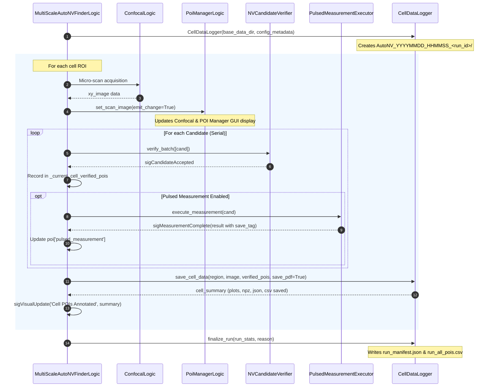

# 27 — Cell Data Logger & Annotated Archiving

## Overview

The `CellDataLogger` module (`logic/cell_data_logger.py`) is responsible for systematic, durable data logging and diagnostic visualization of confocal close-scans during the automated NV finding pipeline. 

Before the orchestrator (`MultiScaleAutoNVFinderLogic`) advances from one cell to the next, it pinpoints, interpolates, and renders all verified and pulsed-measured NV centers onto the high-resolution close-scan image grid and writes a self-contained archive for post-experiment review and publication.

---

## 1. Physical-to-Pixel Coordinate Interpolation

Confocal scanners acquire data along monotonic 1D coordinate axes $X(j)$ and $Y(i)$, where $i \in [0, N_y-1]$ and $j \in [0, N_x-1]$. Because stage refocusing and optical Gaussian fitting yield continuous sub-micron physical coordinates $(x_\text{phys}, y_\text{phys})$, exact sub-pixel positioning is required:

$$\text{col} = j + \frac{x_\text{phys} - X(j)}{X(j+1) - X(j)}$$

$$\text{row} = i + \frac{y_\text{phys} - Y(i)}{Y(i+1) - Y(i)}$$

### Key Functions
- `interpolate_physical_to_pixel(x_m, y_m, x_coords_m, y_coords_m)`: Exact fractional sub-pixel mapping supporting both increasing and decreasing scan coordinate directions.
- `interpolate_pixel_to_physical(col, row, x_coords_m, y_coords_m)`: Inverse bilinear reconstruction from pixel space to physical scanner coordinates in metres.

---

## 2. Annotated Diagnostic Figure Rendering

The `CellDataLogger.render_annotated_cell_image()` method generates a two-panel 200 DPI diagnostic figure (saved as both PNG and vector PDF):

1. **Left Panel: High-Resolution Close-Scan Overlay**:
   - 2D confocal fluorescence intensity map rendered with high-contrast scientific colormaps (`afmhot` / `inferno`).
   - Physical millimeter/micrometer axes ($\mu\mathrm{m}$) with labeled colorbar (counts/s or kc/s).
   - Faint cyan markers for all initial candidate detections from `POIExtractor`.
   - **Dual-Ring Pinpoint Target & Crosshair** for verified NV centers.
   - **Numbered Badges (`#1`, `#2`, ...)** and physical coordinates $(X, Y)\ \mu\mathrm{m}$.
   - **Color-Coded Status Badges**:
     - 🟢 **Vivid Green (`#00FF66`)**: Optically verified AND pulsed measurement completed successfully (`Pulsed: OK`).
     - 🟡 **Amber / Yellow (`#FFCC00`)**: Optically verified but pulsed measurement failed (`Pulsed: FAIL`).
     - 🔵 **Cyan (`#00E5FF`)**: Optically verified without pulsed measurement (`Optically Verified`).

2. **Right Panel: Cell & NV Experiment Manifest**:
   - Cell ROI ID, physical scan FOV ($\mu\mathrm{m} \times \mu\mathrm{m}$), center coordinates, and timestamp.
   - Per-NV diagnostic block listing:
     - Badge ID, Candidate ID, POI Name.
     - Physical coordinates $(X, Y, Z)\ \mu\mathrm{m}$.
     - Optical fit quality metrics ($R^2$ goodness-of-fit, $\sigma_x, \sigma_y$ Gaussian beam widths in nm, peak fluorescence rate in kc/s).
     - Pulsed measurement outcome and unique `save_tag`.

---

## 3. Systematic Directory Hierarchy & Artifacts

All data from an automated run is archived into a timestamped, structured directory hierarchy:

```
qudi/data/
└── AutoNV_YYYYMMDD_HHMMSS_<run_id>/
    ├── run_manifest.json               <- Top-level experiment metadata & run parameters
    ├── run_all_pois.csv                <- Master tabular list of all NVs across all cells
    │
    ├── Cell_<region_id_1>_<timestamp>/
    │   ├── micro_scan_annotated.png    <- High-resolution annotated PNG plot (200 DPI)
    │   ├── micro_scan_annotated.pdf    <- Publication-ready vector graphic PDF
    │   ├── micro_scan_raw.npz          <- Raw 4-channel scan array & monotonic coordinate grids
    │   ├── cell_summary.json           <- Detailed cell diagnostics & enriched POI list
    │   └── cell_pois.csv               <- Tabular CSV linking save_tag to pulsed measurement files
    │
    └── Cell_<region_id_2>_<timestamp>/
        └── ...
```

### Artifact Details

| Filename | Format | Purpose |
|---|---|---|
| `micro_scan_annotated.png` | PNG (200 DPI) | Quick visual inspection and diagnostic preview in GUI / notebooks |
| `micro_scan_annotated.pdf` | Vector PDF | Publication-quality figure with editable vector fonts and lines |
| `micro_scan_raw.npz` | Compressed NumPy | Contains `image_xy` `(Ny, Nx, 4)`, `fluorescence` `(Ny, Nx)`, `x_coords_m`, `y_coords_m`, `z_m`, `region_id` |
| `cell_summary.json` | JSON | Machine-readable manifest with cell dimensions, processable zone stats, and sub-pixel POI coordinates |
| `cell_pois.csv` | CSV | Tabular summary of NV positions, optical metrics, and pulsed `save_tag` references |
| `run_manifest.json` | JSON | Top-level summary updated at start and sealed at completion with run statistics |
| `run_all_pois.csv` | CSV | Global index of all verified and measured NVs across the entire sample |

---

## 4. 1:1 Cross-Referencing to Pulsed Measurement Output

When `PulsedMeasurementExecutor` executes a sequence (e.g. T1 relaxometry), it assigns a deterministic tag:

$$\text{save\_tag} = \texttt{"auto\_nv\_" + candidate\_id + "\_" + run\_id[:8]}$$

This `save_tag` is saved in `cell_summary.json`, `cell_pois.csv`, and on the visual plot side-panel. This allows 1:1 cross-referencing between the cell confocal image and the raw pulsed measurement `.dat` / `.png` files saved by `PulsedMasterLogic` and `SaveLogic`.

---

## 5. Integration with MultiScale Pipeline

The logger is tightly integrated into [`MultiScaleAutoNVFinderLogic`](file:///d:/qudi-working/qudi/logic/multi_scale_auto_nv_finder_logic.py):


