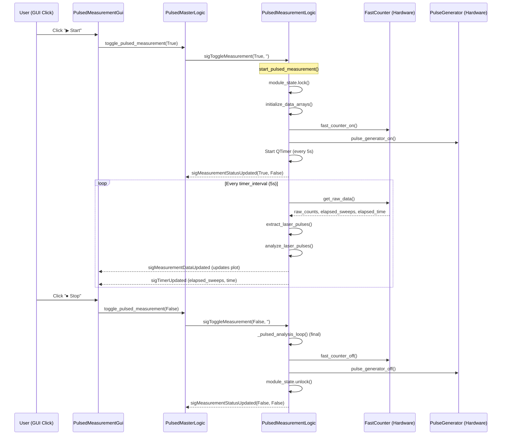

# Analysis: Stop Sweep, T1 Flow & Operations Guide

## Q1. Commit 34fa651 — "Stop Sweep" Analysis

### What The Commit Does

Commit `34fa651` on `master` branch adds a **sweep-count auto-stop** feature at the **hardware level**:

```
gui/pulsed/pulsed_maingui.py             — GUI SpinBox for "Stop sweep:" parameter
gui/pulsed/ui_pulse_analysis.ui          — UI layout (QSpinBox, range 0–10M, default 0)
interface/fast_counter_interface.py      — Added stop_sweep param to configure()
logic/pulsed/pulsed_measurement_logic.py — StatusVar + passes stop_sweep to hardware
```

### Is It The Same Stop?

**No — it's complementary but different from ours.**

| Feature | Commit 34fa651 (`stop_sweep`) | Our `PulsedMeasurementExecutor` |
|---------|-------------------------------|--------------------------------|
| **Where it stops** | Inside the **fast counter hardware** | In the **orchestrator state machine** |
| **How it stops** | Hardware stops acquiring after N sweeps | Software calls `toggle_pulsed_measurement(False)` after timeout |
| **Granularity** | Per-sweep precision | Timer-based (default 15 min) |
| **Default** | 0 = run forever (same as before) | 900s timeout = safety cutoff |
| **Who triggers it** | Hardware driver firmware | Our executor's `QTimer` |
| **Branch** | `master` only | `automation` only |

### Key Insight

The `stop_sweep` parameter flows: **GUI SpinBox → `pulsed_measurement_logic.set_fast_counter_settings()` → `fast_counter.configure()`** — it tells the **hardware** to stop counting after N sweeps. But `pulsed_measurement_logic._pulsed_analysis_loop()` does **NOT** check sweep count and does **NOT** auto-stop. The hardware just stops providing new data.

> [!IMPORTANT]
> **We need to merge `stop_sweep` into our automation branch.** This gives us precise sweep-count control instead of just a time-based timeout. Together:
> - `stop_sweep` = "run exactly N sweeps" (hardware precision)
> - `measurement_timeout_s` = "safety kill after X seconds" (software failsafe)

---

## Q2. How T1 Measurement Starts — Complete Flow

### The Manual T1 Workflow (What You Do Today)

```
Step 1: Open Pulsed GUI → Sequence Generator tab
Step 2: Create/load T1 pulse sequence (π pulse → wait τ → readout)
Step 3: Sample Ensemble → Load to hardware
Step 4: Set Fast Counter parameters (record length, bin width, stop_sweep*)
Step 5: Click "▶ Start Measurement"
Step 6: Wait for data → Click Stop (or stop_sweep auto-stops*)
Step 7: Save data
```
*`stop_sweep` only on master branch

### What Happens Under The Hood



### Does T1 Start Automatically?

**No. It requires explicit steps:**

1. **Ensemble must be pre-created**: You design the pulse sequence in the Pulsed GUI's Sequence Generator (or load a saved one)
2. **Ensemble must be sampled + loaded**: `sample_ensemble('T1_measurement', with_load=True)` compiles the waveform and uploads it to the PulseGenerator hardware
3. **Measurement must be explicitly started**: `toggle_pulsed_measurement(True)` starts the fast counter and pulse generator

### What Our Executor Automates

The `PulsedMeasurementExecutor` automates steps 2-7 of the manual workflow for **each verified NV**:

```
Our Executor Sequence (per NV):
───────────────────────────────
1. Pulser OFF                    ← safety reset
2. Stop any previous measurement ← clean state
3. sample_ensemble("T1_measurement", with_load=True) ← load T1 sequence
4. Wait for sigLoadedAssetUpdated ← hardware confirms loaded
5. toggle_pulsed_measurement(True) ← START T1
6. Wait for timeout (15 min) or stop_sweep* ← data accumulates
7. toggle_pulsed_measurement(False) ← STOP
8. save_measurement_data()        ← save to disk
9. 2s settle                      ← let hardware stabilize
10. Pulser OFF                    ← reset
11. sample_ensemble("laser_pulse_532nm", with_load=True) ← load re-pump
12. Wait for load
13. Pulser ON                     ← re-pump NV for next use
14. COMPLETE → signal to orchestrator
```

### What You Configure (and What You Don't)

| Parameter | Where Set | Default | What It Controls |
|-----------|-----------|---------|-----------------|
| **T1 pulse sequence** | Pulsed GUI → Sequence Generator | *Must create* | The actual π-τ-readout pattern |
| `measurement_ensemble_name` | Multi-Scale GUI / config | `''` | Which ensemble to load (string name) |
| `laser_pulse_ensemble_name` | Multi-Scale GUI / config | `''` | Which re-pump laser to load after |
| `measurement_timeout_s` | Config | 900s (15 min) | How long each T1 run lasts |
| `timer_interval` | PulsedMeasurementLogic StatusVar | 5s | How often data is pulled from hardware |
| `stop_sweep`* | Pulsed GUI / config | 0 (= forever) | Number of sweeps before hardware stops |

> [!WARNING]
> **Before running the automation**: You MUST have created and sampled the T1 ensemble at least once manually through the Pulsed GUI. The ensemble must exist in the `SequenceGeneratorLogic` asset list. The automation only loads by name — it cannot create pulse sequences.

---

## What Needs Updating

### 1. Merge `stop_sweep` from master

The `stop_sweep` feature should be cherry-picked or merged into `automation` branch. This gives us precise sweep-count control.

After merge, update `PulsedMeasurementExecutor` to:
- Add `target_sweeps` StatusVar (default 0 = use timeout)
- If `target_sweeps > 0`: set `stop_sweep` via `set_fast_counter_settings()` before starting measurement
- In `WAIT_MEASUREMENT` state: periodically check `elapsed_sweeps >= target_sweeps` to trigger stop

**~25 lines of code** — straightforward addition.

### 2. Config File Status

The current [`multi_scale_autoNV_confocal.cfg`](file:///D:/qudi-working/qudi/config/multi_scale_autoNV_confocal.cfg) was already updated (see previous session) with:
- `pulsed_measurement_executor` module declaration
- All experiment loop StatusVars
- Updated connectors

**But `pulsedmasterlogic` is NOT in the config** because pulsed hardware blocks aren't configured on this machine. When you're ready, add:

```yaml
logic:
    pulsedmasterlogic:
        module.Class: 'pulsed.pulsed_master_logic.PulsedMasterLogic'
        connect:
            pulsedmeasurementlogic: 'pulsedmeasurementlogic'
            sequencegeneratorlogic: 'sequencegeneratorlogic'

    pulsedmeasurementlogic:
        module.Class: 'pulsed.pulsed_measurement_logic.PulsedMeasurementLogic'
        connect:
            fastcounter: 'your_fast_counter_hardware'
            pulsegenerator: 'your_pulse_generator_hardware'
            fitlogic: 'fitlogic'
            savelogic: 'savelogic'
            microwave: 'your_microwave_hardware'   # optional

    sequencegeneratorlogic:
        module.Class: 'pulsed.sequence_generator_logic.SequenceGeneratorLogic'
        connect:
            pulsegenerator: 'your_pulse_generator_hardware'
```

Then uncomment the connector in `pulsed_measurement_executor`:
```yaml
    pulsed_measurement_executor:
        connect:
            pulsedmasterlogic: 'pulsedmasterlogic'    # ← uncomment this
```

And set `enable_pulsed_measurement: True` in `multi_scale_auto_nv_finder`.

### 3. GUI: Nothing Extra Needed While Running

All experiment parameters are already in the Multi-Scale dock widget. The workflow is:
1. Set parameters in the dock
2. Click Start
3. Watch progress update in real time
4. Parameters are locked during run (disable spinboxes) — **NOT YET IMPLEMENTED** (minor TODO)

---

## Complete Operations Guide: Running the Full Pipeline

### Pre-Flight Checklist

```
[ ] 1. Config file points to multi_scale_autoNV_confocal.cfg
[ ] 2. Physical sample mounted, hardware responsive
[ ] 3. Confocal scanner verified (manual XY scan works)
[ ] 4. Optimizer verified (manual refocus on a known bright spot works)
[ ] 5. (If pulsed) T1 ensemble created in Pulsed GUI and sampled at least once
[ ] 6. (If pulsed) Laser re-pump ensemble created and sampled at least once
[ ] 7. (If pulsed) Fast counter settings configured (bin width, record length)
```

### Step-by-Step Startup

#### Phase A: Verify Hardware (5 minutes)

1. Start Qudi with `multi_scale_autoNV_confocal.cfg`
2. Open **Confocal GUI** → do a test XY scan → verify you see NVs
3. Open **POI Manager** → click **Get ROI from Confocal**
4. Verify the Multi-Scale dock widget is visible at the bottom

#### Phase B: Configure Experiment (2 minutes)

In the **Multi-Scale Auto NV Finder** dock:

| Setting | Typical Value | Notes |
|---------|--------------|-------|
| Macro FOV | 100 µm | Initial wide scan area |
| Micro Margin | 0.15 | 15% padding around detected cells |
| Max Regions | 10 | Max cells to process |
| No. of cells | 5 | Target number of cells |
| NVs per cell | 3 | Target NVs per cell |
| POI non-repetition radius | 1.0 µm | Min distance between measured NVs |
| Enable pulsed measurement | ☐ / ☑ | Enable only if pulsed hardware is ready |
| Measurement ensemble | `T1_measurement` | Must match name in Pulsed GUI |
| Laser pulse ensemble | `laser_pulse_532nm` | Must match name in Pulsed GUI |

#### Phase C: Run (15-60 minutes depending on targets)

1. Click **▶ Start Multi-Scale**
2. Watch the automated sequence:
   - **Macro Scanning** → wide-field confocal scan
   - **Segmenting** → cell detection, bounding boxes appear (yellow)
   - **Micro Scanning** → zoomed confocal scan of each cell (box turns blue)
   - **Processing** → CIP detection within processable zone
   - **Verifying** → optimizer refocus on each NV candidate
   - **Measuring** → T1 measurement on each verified NV (if enabled)
   - Box turns green when cell is complete
3. Real-time progress shows: cells completed, NVs this cell, total NVs

#### Phase D: Review Data

After completion:
- **POI Manager** shows all registered NVs
- **Verification logs**: `C:/Data/[Date]/NVCandidateVerifier/[run_id]/manifest.json`
- **Drift data**: Check DriftTracker output for position stability
- **T1 data**: In standard Qudi data directory, tagged `auto_nv_[candidate]_[run_id]`

### Emergency Stop

Click **⏹ Stop** at any time. The system will:
1. Finish the current hardware operation (can't interrupt mid-scan)
2. Save any in-progress data
3. Return to idle

---

## Summary of Decisions Needed

| Decision | Options | Recommendation |
|----------|---------|----------------|
| Merge `stop_sweep` from master? | Yes / Later | **Yes** — gives precise control |
| T1 duration control? | Timeout only / Add sweep-count | **Both** — timeout as safety, sweep-count as primary |
| Enable pulsed in automation? | Now / After calibration | **After** — run detection-only first to validate, then enable pulsed |
