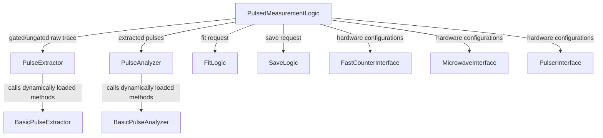

# Pulsed Measurement Logic Documentation

This document provides a detailed breakdown of the `PulsedMeasurementLogic` module in Qudi, describing its architecture, class structure, functions, status variables, signals, and internal/external invocations with deep links.

---

## 1. System Architecture & Component Interaction

The [PulsedMeasurementLogic](file:///d:/qudi-working/qudi/logic/pulsed/pulsed_measurement_logic.py#L42) class acts as the orchestrator for pulsed measurements. It coordinates:
- **Pulsing hardware** via the [PulserInterface](file:///d:/qudi-working/qudi/interface/pulser_interface.py#L30) connector.
- **Signal counting hardware** via the [FastCounterInterface](file:///d:/qudi-working/qudi/interface/fast_counter_interface.py#L27) connector.
- **External CW Microwave hardware** via the [MicrowaveInterface](file:///d:/qudi-working/qudi/interface/microwave_interface.py#L50) connector.
- **Trace extraction logic** via [PulseExtractor](file:///d:/qudi-working/qudi/logic/pulsed/pulse_extractor.py#L63).
- **Flank integration and processing** via [PulseAnalyzer](file:///d:/qudi-working/qudi/logic/pulsed/pulse_analyzer.py#L63).
- **Curve fitting** via [FitLogic](file:///d:/qudi-working/qudi/logic/fit_logic.py#L40).
- **Data storage and serialization** via [SaveLogic](file:///d:/qudi-working/qudi/logic/save_logic.py#L118).

### Orchestration Flow

---

## 2. Connectors, Configuration Options, and Status Variables

Defined at class level in [pulsed_measurement_logic.py](file:///d:/qudi-working/qudi/logic/pulsed/pulsed_measurement_logic.py#L47-L114):

### Connectors
* **`fitlogic`**: Connects to `FitLogic` for curve fitting.
  - Definition: `fitlogic = Connector(interface='FitLogic')` ([L48](file:///d:/qudi-working/qudi/logic/pulsed/pulsed_measurement_logic.py#L48))
* **`savelogic`**: Connects to `SaveLogic` for data storage.
  - Definition: `savelogic = Connector(interface='SaveLogic')` ([L49](file:///d:/qudi-working/qudi/logic/pulsed/pulsed_measurement_logic.py#L49))
* **`fastcounter`**: Connects to `FastCounterInterface` for counting events/photons.
  - Definition: `fastcounter = Connector(interface='FastCounterInterface')` ([L50](file:///d:/qudi-working/qudi/logic/pulsed/pulsed_measurement_logic.py#L50))
* **`microwave`**: Connects to `MicrowaveInterface` for CW microwave output.
  - Definition: `microwave = Connector(interface='MicrowaveInterface')` ([L51](file:///d:/qudi-working/qudi/logic/pulsed/pulsed_measurement_logic.py#L51))
* **`pulsegenerator`**: Connects to `PulserInterface` to run pulse sequences.
  - Definition: `pulsegenerator = Connector(interface='PulserInterface')` ([L52](file:///d:/qudi-working/qudi/logic/pulsed/pulsed_measurement_logic.py#L52))

### Configuration Options
* **`extraction_import_path`**: Optional extra directory to import custom pulse extractor modules.
  - Definition: `extraction_import_path = ConfigOption(name='additional_extraction_path', default=None)` ([L56](file:///d:/qudi-working/qudi/logic/pulsed/pulsed_measurement_logic.py#L56))
* **`analysis_import_path`**: Optional extra directory to import custom pulse analyzer modules.
  - Definition: `analysis_import_path = ConfigOption(name='additional_analysis_path', default=None)` ([L57](file:///d:/qudi-working/qudi/logic/pulsed/pulsed_measurement_logic.py#L57))
* **`_raw_data_save_type`**: Format type for raw count traces when saving (`'text'`, etc.).
  - Definition: `_raw_data_save_type = ConfigOption(name='raw_data_save_type', default='text')` ([L59](file:///d:/qudi-working/qudi/logic/pulsed/pulsed_measurement_logic.py#L59))

---

## 3. Class Method Reference and Deep Invocations

### Initialization & Lifecycle

#### `__init__(self, config, **kwargs)`
* **File & Line**: [L116-L154](file:///d:/qudi-working/qudi/logic/pulsed/pulsed_measurement_logic.py#L116)
* **Parameters**:
  - `config` *(dict)*: Dictionary of config parameters.
  - `**kwargs` *(dict)*: Additional arguments.
* **Description**: Initializes parent [GenericLogic](file:///d:/qudi-working/qudi/logic/generic_logic.py#L26), setups local data structures, mutex locks, default fit states, and empty arrays.
* **Invocations**:
  - [GenericLogic.__init__(self, config=config, **kwargs)](file:///d:/qudi-working/qudi/logic/generic_logic.py#L28)

#### `on_activate(self)`
* **File & Line**: [L156-L218](file:///d:/qudi-working/qudi/logic/pulsed/pulsed_measurement_logic.py#L156)
* **Description**: Sets up the QTimer and helper sub-modules, checks and applies initial hardware constraints.
* **Invocations**:
  - `PulseExtractor(pulsedmeasurementlogic=self)` in [logic/pulsed/pulse_extractor.py:L84](file:///d:/qudi-working/qudi/logic/pulsed/pulse_extractor.py#L84)
  - `PulseAnalyzer(pulsedmeasurementlogic=self)` in [logic/pulsed/pulse_analyzer.py:L84](file:///d:/qudi-working/qudi/logic/pulsed/pulse_analyzer.py#L84)
  - `self.fitlogic().make_fit_container('pulsed', '1d')` in [logic/fit_logic.py:L273](file:///d:/qudi-working/qudi/logic/fit_logic.py#L273)
  - `self.pulse_generator_off()` in [L495](file:///d:/qudi-working/qudi/logic/pulsed/pulsed_measurement_logic.py#L495)
  - `self.fastcounter().get_constraints()` in [interface/fast_counter_interface.py:L44](file:///d:/qudi-working/qudi/interface/fast_counter_interface.py#L44)
  - `self.fast_counter_off()` in [L315](file:///d:/qudi-working/qudi/logic/pulsed/pulsed_measurement_logic.py#L315)
  - `self.fastcounter().is_gated()` in [interface/fast_counter_interface.py:L142](file:///d:/qudi-working/qudi/interface/fast_counter_interface.py#L142)
  - `self.set_fast_counter_settings()` in [L260](file:///d:/qudi-working/qudi/logic/pulsed/pulsed_measurement_logic.py#L260)
  - `self.microwave_off()` in [L404](file:///d:/qudi-working/qudi/logic/pulsed/pulsed_measurement_logic.py#L404)
  - `self.set_microwave_settings(...)` in [L434](file:///d:/qudi-working/qudi/logic/pulsed/pulsed_measurement_logic.py#L434)
  - `self._initialize_data_arrays()` in [L1233](file:///d:/qudi-working/qudi/logic/pulsed/pulsed_measurement_logic.py#L1233)

#### `on_deactivate(self)`
* **File & Line**: [L219-L235](file:///d:/qudi-working/qudi/logic/pulsed/pulsed_measurement_logic.py#L219)
* **Description**: Unlocks modules, cleans up settings, and disconnects Qt timer loops.
* **Invocations**:
  - `self.stop_pulsed_measurement()` in [L822](file:///d:/qudi-working/qudi/logic/pulsed/pulsed_measurement_logic.py#L822)

---

### Fast Counter Control

#### `set_fast_counter_settings(self, settings_dict=None, **kwargs)`
* **File & Line**: [L260-L307](file:///d:/qudi-working/qudi/logic/pulsed/pulsed_measurement_logic.py#L260)
* **Parameters**:
  - `settings_dict` *(dict, optional)*: Dictionary containing `bin_width`, `record_length`, and `number_of_gates`.
  - `**kwargs` *(dict)*: Overrides settings if passed as separate arguments.
* **Invocations**:
  - `self.fastcounter().get_status()` in [interface/fast_counter_interface.py:L104](file:///d:/qudi-working/qudi/interface/fast_counter_interface.py#L104)
  - `self.fastcounter().is_gated()` in [interface/fast_counter_interface.py:L142](file:///d:/qudi-working/qudi/interface/fast_counter_interface.py#L142)
  - `self.fastcounter().configure(...)` in [interface/fast_counter_interface.py:L89](file:///d:/qudi-working/qudi/interface/fast_counter_interface.py#L89)
  - Emits signal `sigFastCounterSettingsUpdated` with `self.fast_counter_settings` ([L241](file:///d:/qudi-working/qudi/logic/pulsed/pulsed_measurement_logic.py#L241))

#### `fast_counter_on(self)`
* **File & Line**: [L308-L314](file:///d:/qudi-working/qudi/logic/pulsed/pulsed_measurement_logic.py#L308)
* **Invocations**:
  - `self.fastcounter().start_measure()` in [interface/fast_counter_interface.py:L116](file:///d:/qudi-working/qudi/interface/fast_counter_interface.py#L116)

#### `fast_counter_off(self)`
* **File & Line**: [L315-L321](file:///d:/qudi-working/qudi/logic/pulsed/pulsed_measurement_logic.py#L315)
* **Invocations**:
  - `self.fastcounter().stop_measure()` in [interface/fast_counter_interface.py:L121](file:///d:/qudi-working/qudi/interface/fast_counter_interface.py#L121)

---

### External Microwave Control

#### `set_microwave_settings(self, settings_dict=None, **kwargs)`
* **File & Line**: [L434-L476](file:///d:/qudi-working/qudi/logic/pulsed/pulsed_measurement_logic.py#L434)
* **Parameters**:
  - `settings_dict` *(dict, optional)*: Keys can include `power`, `frequency`, and `use_ext_microwave`.
  - `**kwargs`: Keyword overrides.
* **Invocations**:
  - `self.microwave().get_status()` in [interface/microwave_interface.py:L69](file:///d:/qudi-working/qudi/interface/microwave_interface.py#L69)
  - `self.microwave().set_cw(...)` in [interface/microwave_interface.py:L108](file:///d:/qudi-working/qudi/interface/microwave_interface.py#L108)
  - Emits signal `sigExtMicrowaveSettingsUpdated` ([L107](file:///d:/qudi-working/qudi/logic/pulsed/pulsed_measurement_logic.py#L107))

#### `microwave_on(self)`
* **File & Line**: [L391-L403](file:///d:/qudi-working/qudi/logic/pulsed/pulsed_measurement_logic.py#L391)
* **Invocations**:
  - `self.microwave().cw_on()` in [interface/microwave_interface.py:L98](file:///d:/qudi-working/qudi/interface/microwave_interface.py#L98)
  - `self.microwave().get_status()` in [interface/microwave_interface.py:L69](file:///d:/qudi-working/qudi/interface/microwave_interface.py#L69)
  - Emits signal `sigExtMicrowaveRunningUpdated` ([L106](file:///d:/qudi-working/qudi/logic/pulsed/pulsed_measurement_logic.py#L106))

#### `microwave_off(self)`
* **File & Line**: [L404-L415](file:///d:/qudi-working/qudi/logic/pulsed/pulsed_measurement_logic.py#L404)
* **Invocations**:
  - `self.microwave().off()` in [interface/microwave_interface.py:L59](file:///d:/qudi-working/qudi/interface/microwave_interface.py#L59)
  - `self.microwave().get_status()` in [interface/microwave_interface.py:L69](file:///d:/qudi-working/qudi/interface/microwave_interface.py#L69)
  - Emits signal `sigExtMicrowaveRunningUpdated` ([L106](file:///d:/qudi-working/qudi/logic/pulsed/pulsed_measurement_logic.py#L106))

---

### Pulse Generator Control

#### `pulse_generator_on(self)`
* **File & Line**: [L485-L494](file:///d:/qudi-working/qudi/logic/pulsed/pulsed_measurement_logic.py#L485)
* **Invocations**:
  - `self.pulsegenerator().pulser_on()` in [interface/pulser_interface.py:L487](file:///d:/qudi-working/qudi/interface/pulser_interface.py) (Wait, abstract pulser turn on method)
  - Emits signal `sigPulserRunningUpdated` ([L105](file:///d:/qudi-working/qudi/logic/pulsed/pulsed_measurement_logic.py#L105))

#### `pulse_generator_off(self)`
* **File & Line**: [L495-L504](file:///d:/qudi-working/qudi/logic/pulsed/pulsed_measurement_logic.py#L495)
* **Invocations**:
  - `self.pulsegenerator().pulser_off()` in [interface/pulser_interface.py:L497](file:///d:/qudi-working/qudi/interface/pulser_interface.py)
  - Emits signal `sigPulserRunningUpdated` ([L105](file:///d:/qudi-working/qudi/logic/pulsed/pulsed_measurement_logic.py#L105))

---

### Measurement Control & Fitting

#### `set_measurement_settings(self, settings_dict=None, **kwargs)`
* **File & Line**: [L687-L743](file:///d:/qudi-working/qudi/logic/pulsed/pulsed_measurement_logic.py#L687)
* **Parameters**:
  - `settings_dict` *(dict, optional)*: settings to configure.
  - `**kwargs`: Key overrides.
* **Invocations**:
  - `self._apply_invoked_settings()` in [L1022](file:///d:/qudi-working/qudi/logic/pulsed/pulsed_measurement_logic.py#L1022)
  - `self.fc.set_units(self._data_units)` on FitContainer in [logic/fit_logic.py](file:///d:/qudi-working/qudi/logic/fit_logic.py)
  - `self.set_fast_counter_settings(number_of_gates=...)` in [L260](file:///d:/qudi-working/qudi/logic/pulsed/pulsed_measurement_logic.py#L260)
  - `self._measurement_settings_sanity_check()` in [L1086](file:///d:/qudi-working/qudi/logic/pulsed/pulsed_measurement_logic.py#L1086)
  - Emits signal `sigMeasurementSettingsUpdated` ([L109](file:///d:/qudi-working/qudi/logic/pulsed/pulsed_measurement_logic.py#L109))

#### `start_pulsed_measurement(self, stashed_raw_data_tag='')`
* **File & Line**: [L757-L820](file:///d:/qudi-working/qudi/logic/pulsed/pulsed_measurement_logic.py#L757)
* **Description**: Configures and starts all hardware devices (microwave, fast counter, pulser) and the timer loop.
* **Invocations**:
  - `self._apply_invoked_settings()` in [L1022](file:///d:/qudi-working/qudi/logic/pulsed/pulsed_measurement_logic.py#L1022)
  - `self.do_fit('No Fit', False)`, `self.do_fit('No Fit', True)` in [L978](file:///d:/qudi-working/qudi/logic/pulsed/pulsed_measurement_logic.py#L978)
  - `self._initialize_data_arrays()` in [L1233](file:///d:/qudi-working/qudi/logic/pulsed/pulsed_measurement_logic.py#L1233)
  - `self.microwave_on()` in [L391](file:///d:/qudi-working/qudi/logic/pulsed/pulsed_measurement_logic.py#L391)
  - `self.fast_counter_on()` in [L308](file:///d:/qudi-working/qudi/logic/pulsed/pulsed_measurement_logic.py#L308)
  - `self.pulse_generator_on()` in [L485](file:///d:/qudi-working/qudi/logic/pulsed/pulsed_measurement_logic.py#L485)
  - Emits signal `sigTimerUpdated` ([L102](file:///d:/qudi-working/qudi/logic/pulsed/pulsed_measurement_logic.py#L102))
  - Emits signal `sigStartTimer` ([L113](file:///d:/qudi-working/qudi/logic/pulsed/pulsed_measurement_logic.py#L113))

#### `stop_pulsed_measurement(self, stash_raw_data_tag='')`
* **File & Line**: [L821-L857](file:///d:/qudi-working/qudi/logic/pulsed/pulsed_measurement_logic.py#L821)
* **Description**: Performs one final loop, and safely stops all hardware devices.
* **Invocations**:
  - `self._pulsed_analysis_loop()` in [L1107](file:///d:/qudi-working/qudi/logic/pulsed/pulsed_measurement_logic.py#L1107)
  - Emits signal `sigStopTimer` ([L114](file:///d:/qudi-working/qudi/logic/pulsed/pulsed_measurement_logic.py#L114))
  - `self.fast_counter_off()` in [L315](file:///d:/qudi-working/qudi/logic/pulsed/pulsed_measurement_logic.py#L315)
  - `self.pulse_generator_off()` in [L495](file:///d:/qudi-working/qudi/logic/pulsed/pulsed_measurement_logic.py#L495)
  - `self.microwave_off()` in [L404](file:///d:/qudi-working/qudi/logic/pulsed/pulsed_measurement_logic.py#L404)
  - Emits signal `sigMeasurementStatusUpdated` ([L104](file:///d:/qudi-working/qudi/logic/pulsed/pulsed_measurement_logic.py#L104))

#### `do_fit(self, fit_method, use_alternative_data=False, data=None)`
* **File & Line**: [L978-L1021](file:///d:/qudi-working/qudi/logic/pulsed/pulsed_measurement_logic.py#L978)
* **Parameters**:
  - `fit_method` *(str)*: Fit method name.
  - `use_alternative_data` *(bool)*: Fits alternative data if `True`.
  - `data` *(np.ndarray, optional)*: Explicit raw data to fit.
* **Invocations**:
  - `self.fc.set_current_fit(fit_method)` in [logic/fit_logic.py](file:///d:/qudi-working/qudi/logic/fit_logic.py)
  - `self.fc.do_fit(data[0], data[1])` on FitContainer
  - Emits signal `sigFitUpdated` ([L103](file:///d:/qudi-working/qudi/logic/pulsed/pulsed_measurement_logic.py#L103))

---

### Internal Processing Loop

#### `_pulsed_analysis_loop(self)`
* **File & Line**: [L1107-L1156](file:///d:/qudi-working/qudi/logic/pulsed/pulsed_measurement_logic.py#L1107)
* **Description**: Triggered periodically by the `__analysis_timer`. Executes trace extraction, pulse analysis, ordering, alternative data computation, and GUI notification.
* **Invocations**:
  - `self._extract_laser_pulses()` in [L1157](file:///d:/qudi-working/qudi/logic/pulsed/pulsed_measurement_logic.py#L1157)
  - `self._analyze_laser_pulses()` in [L1172](file:///d:/qudi-working/qudi/logic/pulsed/pulsed_measurement_logic.py#L1172)
  - `self._compute_alt_data()` in [L1607](file:///d:/qudi-working/qudi/logic/pulsed/pulsed_measurement_logic.py#L1607)
  - Emits signal `sigTimerUpdated` ([L102](file:///d:/qudi-working/qudi/logic/pulsed/pulsed_measurement_logic.py#L102))
  - Emits signal `sigMeasurementDataUpdated` ([L101](file:///d:/qudi-working/qudi/logic/pulsed/pulsed_measurement_logic.py#L101))

#### `_extract_laser_pulses(self)`
* **File & Line**: [L1157-L1171](file:///d:/qudi-working/qudi/logic/pulsed/pulsed_measurement_logic.py#L1157)
* **Invocations**:
  - `self._get_raw_data()` in [L1183](file:///d:/qudi-working/qudi/logic/pulsed/pulsed_measurement_logic.py#L1183)
  - `self._pulseextractor.extract_laser_pulses(self.raw_data)` in [logic/pulsed/pulse_extractor.py:L205](file:///d:/qudi-working/qudi/logic/pulsed/pulse_extractor.py#L205)

#### `_analyze_laser_pulses(self)`
* **File & Line**: [L1172-L1182](file:///d:/qudi-working/qudi/logic/pulsed/pulsed_measurement_logic.py#L1172)
* **Invocations**:
  - `self._pulseanalyzer.analyse_laser_pulses(self.laser_data)` in [logic/pulsed/pulse_analyzer.py:L194](file:///d:/qudi-working/qudi/logic/pulsed/pulse_analyzer.py#L194)

#### `_get_raw_data(self)`
* **File & Line**: [L1183-L1232](file:///d:/qudi-working/qudi/logic/pulsed/pulsed_measurement_logic.py#L1183)
* **Invocations**:
  - `self.fastcounter().get_data_trace()` in [interface/fast_counter_interface.py:L159](file:///d:/qudi-working/qudi/interface/fast_counter_interface.py#L159)
  - `netobtain(fc_data)` in [core/util/network.py:L26](file:///d:/qudi-working/qudi/core/util/network.py#L26)

#### `_compute_alt_data(self)`
* **File & Line**: [L1607-L1635](file:///d:/qudi-working/qudi/logic/pulsed/pulsed_measurement_logic.py#L1607)
* **Description**: Performs Fourier transform (`FFT`) or computes differential trace (`Delta`) on the readout.
* **Invocations**:
  - `compute_ft(...)` in [core/util/math.py:L57](file:///d:/qudi-working/qudi/core/util/math.py#L57)

---

### Saving Data

#### `save_measurement_data(self, tag=None, with_error=True, save_laser_pulses=True, save_pulsed_measurement=True, save_figure=True)`
* **File & Line**: [L1267-L1605](file:///d:/qudi-working/qudi/logic/pulsed/pulsed_measurement_logic.py#L1267)
* **Invocations**:
  - `self.savelogic().get_path_for_module('PulsedMeasurement')` in [logic/save_logic.py:L615](file:///d:/qudi-working/qudi/logic/save_logic.py#L615)
  - `self.savelogic().save_data(...)` in [logic/save_logic.py:L240](file:///d:/qudi-working/qudi/logic/save_logic.py#L240)
  - `units.ScaledFloat(max_val)` in [core/util/units.py:L59](file:///d:/qudi-working/qudi/core/util/units.py#L59)
  - `units.create_formatted_output(...)` in [core/util/units.py:L140](file:///d:/qudi-working/qudi/core/util/units.py#L140)

---

## 4. Helper Sub-modules

### A. PulseExtractor
Defined in [logic/pulsed/pulse_extractor.py](file:///d:/qudi-working/qudi/logic/pulsed/pulse_extractor.py#L63).
Acts as a manager that dynamically imports modules from the [logic/pulsed/pulse_extraction_methods](file:///d:/qudi-working/qudi/logic/pulsed/pulse_extraction_methods) directory. It detects classes extending [PulseExtractorBase](file:///d:/qudi-working/qudi/logic/pulsed/pulse_extractor.py#L31) and populates extraction methods.

#### `extract_laser_pulses(self, count_data)`
* **File & Line**: [pulse_extractor.py:L205](file:///d:/qudi-working/qudi/logic/pulsed/pulse_extractor.py#L205)
* **Parameters**: `count_data` *(np.ndarray)*: 1D (ungated) or 2D (gated) trace.
* **Invocations**: Calls the active method from [basic_extraction_methods.py](file:///d:/qudi-working/qudi/logic/pulsed/pulse_extraction_methods/basic_extraction_methods.py):
  1. `gated_conv_deriv(self, count_data, conv_std_dev=20.0, flank_width=0)` ([basic_extraction_methods.py:L35](file:///d:/qudi-working/qudi/logic/pulsed/pulse_extraction_methods/basic_extraction_methods.py#L35))
     - Invokes `scipy.ndimage.filters.gaussian_filter1d` for noise smoothing.
     - Invokes `numpy.gradient` to get gradient and spot flanks.
  2. `ungated_conv_deriv(self, count_data, conv_std_dev=20.0)` ([basic_extraction_methods.py:L87](file:///d:/qudi-working/qudi/logic/pulsed/pulse_extraction_methods/basic_extraction_methods.py#L87))
     - Invokes `scipy.ndimage.filters.gaussian_filter1d` and `numpy.gradient` to identify individual laser pulse rising/falling inflection points.

---

### B. PulseAnalyzer
Defined in [logic/pulsed/pulse_analyzer.py](file:///d:/qudi-working/qudi/logic/pulsed/pulse_analyzer.py#L63).
Dynamically imports analyzer modules from [logic/pulsed/pulsed_analysis_methods](file:///d:/qudi-working/qudi/logic/pulsed/pulsed_analysis_methods) extending [PulseAnalyzerBase](file:///d:/qudi-working/qudi/logic/pulsed/pulse_analyzer.py#L31).

#### `analyse_laser_pulses(self, laser_data)`
* **File & Line**: [pulse_analyzer.py:L194](file:///d:/qudi-working/qudi/logic/pulsed/pulse_analyzer.py#L194)
* **Parameters**: `laser_data` *(np.ndarray)*: 2D array of individual laser pulses.
* **Invocations**: Calls the selected method in [basic_analysis_methods.py](file:///d:/qudi-working/qudi/logic/pulsed/pulsed_analysis_methods/basic_analysis_methods.py):
  1. `analyse_mean_norm(self, laser_data, signal_start, signal_end, norm_start, norm_end)` ([basic_analysis_methods.py:L34](file:///d:/qudi-working/qudi/logic/pulsed/pulsed_analysis_methods/basic_analysis_methods.py#L34))
     - Divides signal window mean by normalization window mean. Calculates Gaussian error propagation.
  2. `analyse_sum(self, laser_data, signal_start, signal_end)` ([basic_analysis_methods.py:L145](file:///d:/qudi-working/qudi/logic/pulsed/pulsed_analysis_methods/basic_analysis_methods.py#L145))
     - Sums counts in signal window.
  3. `analyse_mean(self, laser_data, signal_start, signal_end)` ([basic_analysis_methods.py:L187](file:///d:/qudi-working/qudi/logic/pulsed/pulsed_analysis_methods/basic_analysis_methods.py#L187))
     - Takes mean count in signal window.
  4. `analyse_pass_through(self, laser_data)` ([basic_analysis_methods.py:L228](file:///d:/qudi-working/qudi/logic/pulsed/pulsed_analysis_methods/basic_analysis_methods.py#L228))
     - Bypasses analysis, returning mean or flattened raw counts.
  5. `analyse_mean_reference(self, laser_data, signal_start, signal_end, norm_start, norm_end)` ([basic_analysis_methods.py:L247](file:///d:/qudi-working/qudi/logic/pulsed/pulsed_analysis_methods/basic_analysis_methods.py#L247))
     - Subtracts reference mean from signal window mean.
